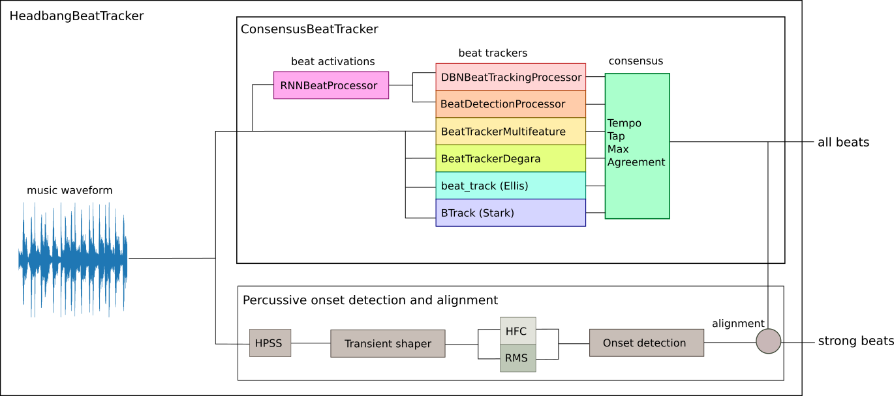

# headbang.py

headbang.py is a collection of projects related to beat tracking in metal music.

See more at https://sevagh.github.io/headbang.py

## headbang

### Algorithm



### Installation

headbang has been written and verified with Python 3.8 on AMD64 machines running Fedora 32 Linux. However, there shouldn't be any problems running it on different machines if the requirements can be successfully installed.

The only sticking point is that the [BTrack](https://github.com/adamstark/BTrack) package is not on pip, and needs to be installed manually. My [fork](https://github.com/sevagh/BTrack) supports a Python 3.8 install:

```
sevagh:~ $ git clone https://github.com/sevagh/BTrack
sevagh:~ $ cd BTrack/modules-and-plug-ins/python-module
sevagh:python-module $ python3.8 setup.py build

# install to your system
sevagh:python-module $ sudo python3.8 setup.py install

# OR #

# install for your local user
sevagh:python-module $ pip3.8 install --user -e .
```

### Usage

Headbang is:
* [`headbang/`](./headbang), a Python library for beat tracking, consisting of the following classes:
    * [ConsensusBeatTracker](https://github.com/sevagh/headbang.py/blob/master/headbang/beattrack.py#L49)
      ```python
      import multiprocessing
      import librosa

      from headbang.beattrack import ConsensusBeatTracker

      pool = multiprocessing.Pool()

      x, fs = librosa.load('mysongwithbeats.wav')
      cbt = ConsensusBeatTracker(pool)

      beats = cbt.beats(x)
      ```
    * [HeadbangBeatTracker](https://github.com/sevagh/headbang.py/blob/master/headbang/headbang.py#L37)
      ```python
      import multiprocessing
      import librosa

      from headbang import HeadbangBeatTracker

      pool = multiprocessing.Pool()

      x, fs = librosa.load('mysongwithbeats.wav')
      hbt = HeadbangBeatTracker(pool)

      beats = hbt.beats(x)
      ```
* [`bin/beat_track.py`](./bin/beat_track.py), which implements all of the parameters of the consensus and headbang beat trackers in command-line arguments, loads an audio file, gets beat locations, and outputs an audio file with clicks on the beat locations
  ```
  sevagh:headbang.py $ ./bin/beat_track.py --help
  [   INFO   ] MusicExtractorSVM: no classifier models were configured by default
  usage: headbang.py [-h] [--algorithms ALGORITHMS]
                     [--onset-align-threshold-s ONSET_ALIGN_THRESHOLD_S]
                     [--max-no-beats MAX_NO_BEATS]
                     [--onset-near-threshold-s ONSET_NEAR_THRESHOLD_S]
                     [--onset-silence-threshold ONSET_SILENCE_THRESHOLD]
                     [--n-pool N_POOL] [--show-plots] [--disable-onsets]
                     [--beats-out BEATS_OUT]
                     [--harmonic-margin HARMONIC_MARGIN]
                     [--harmonic-frame HARMONIC_FRAME]
                     [--percussive-margin PERCUSSIVE_MARGIN]
                     [--percussive-frame PERCUSSIVE_FRAME]
                     [--fast-attack-ms FAST_ATTACK_MS]
                     [--slow-attack-ms SLOW_ATTACK_MS]
                     [--release-ms RELEASE_MS]
                     [--power-memory-ms POWER_MEMORY_MS]
                     [--filter-order FILTER_ORDER]
                     wav_in wav_out
  
  Accurate percussive beat tracking for metal songs
  
  positional arguments:
    wav_in                input wav file
    wav_out               output wav file
  
  optional arguments:
    -h, --help            show this help message and exit
    --n-pool N_POOL       How many threads to use in multiprocessing pool
                          (default: 7)
    --show-plots          Display plots of intermediate steps describing the
                          algorithm using matplotlib (default: False)
    --disable-onsets      disable onset alignment, only output consensus beats
                          (default: False)
    --beats-out BEATS_OUT
                          output beats txt file (default: )
  
  beat arguments:
    --algorithms ALGORITHMS
                          List of beat tracking algorithms to apply (default:
                          1,2,3,4,5,6)
    --onset-align-threshold-s ONSET_ALIGN_THRESHOLD_S
                          How close beats should align with onsets (in seconds)
                          (default: 0.07)
  
  onsets arguments:
    --max-no-beats MAX_NO_BEATS
                          Segments with missing beats to substitute onsets
                          (default: 1.0)
    --onset-near-threshold-s ONSET_NEAR_THRESHOLD_S
                          How close onsets should be (in seconds) when
                          supplementing onset information (default: 0.35)
    --onset-silence-threshold ONSET_SILENCE_THRESHOLD
                          Silence threshold (default: 0.035)
  
  hpss arguments:
    --harmonic-margin HARMONIC_MARGIN
                          Separation margin for HPSS harmonic iteration
                          (default: 2.3)
    --harmonic-frame HARMONIC_FRAME
                          T-F/frame size for HPSS harmonic iteration (default:
                          16384)
    --percussive-margin PERCUSSIVE_MARGIN
                          Separation margin for HPSS percussive iteration
                          (default: 2.3)
    --percussive-frame PERCUSSIVE_FRAME
                          T-F/frame size for HPSS percussive iteration
                          (default: 256)
  
  multiband transient shaper arguments:
    --fast-attack-ms FAST_ATTACK_MS
                          Fast attack (ms) (default: 1)
    --slow-attack-ms SLOW_ATTACK_MS
                          Slow attack (ms) (default: 15)
    --release-ms RELEASE_MS
                          Release (ms) (default: 20)
    --power-memory-ms POWER_MEMORY_MS
                          Power filter memory (ms) (default: 1)
    --filter-order FILTER_ORDER
                          Bandpass (butter) filter order (default: 3)
  ```

## headbang-hud

headbang-hud is a combined MIR beat tracking (using the `headbang` beat tracking code) and 2D pose estimation project for tracking headbanging motion.

### Architecture


### Installation

After installing BTrack for headbang, you also need to build and install [openpose](https://github.com/CMU-Perceptual-Computing-Lab/openpose) from source. I followed the instructions for building and installing the Python module successfully on Python 3.7, Fedora 32, amd64 with no issues.

Then, run install `pip install -r headbang-hud/requirements.txt` with the tool of your choice (venv, etc.).

### Usage

headbang-hud is opinionated and doesn't have many arguments or flags. Call it on the input video file (any format supported by [moviepy](https://github.com/Zulko/moviepy)):

```
(headbang) sevagh:headbang.py $ ./headbang-hud/headbang-hud.py ./input.mp4 output.mp4
[   INFO   ] MusicExtractorSVM: no classifier models were configured by default
Starting OpenPose Python Wrapper...
Auto-detecting all available GPUs... Detected 1 GPU(s), using 1 of them starting at GPU 0.
Consensus beat tracker algos: madmom DBNBeatTrackingProcessor,
                madmom BeatDetectionProcessor,
                essentia BeatTrackerMultiFeature,
                essentia BeatTrackerDegara,
                librosa beat_track,
                BTrack
Getting beat locations using consensus beat tracking
Creating percussive separation with enhanced transients for percussive onset detection
Iteration 1 of hpss: frame = 16384, margin = 2.3
Iteration 2 of hpss: frame = 256, margin = 2.3
Applying multiband transient shaper:
        fast attack (ms) = 1,
        slow attack (ms) = 15,
        release (ms) = 20,
        power memory (ms) = 1,
        filter order = 3
Detecting percussive onsets with methods ['hfc', 'rms']
Aligning agreed beats with percussive onsets
Trying to substitute percussive onsets in place of absent beats
segment with no beats: 0.5320294499397278-1.5420634746551514
segment with no beats: 1.5420634746551514-3.562131404876709
Processing video - first pass with pose detection
Moviepy - Building video /tmp/headbang-hud-tmp.mp4.
Moviepy - Writing video /tmp/headbang-hud-tmp.mp4
Moviepy - Done !
Moviepy - video ready /tmp/headbang-hud-tmp.mp4
Marking beat and head bop positions on output frames
run a gc, just in case...
Processing video - second pass with marked event locations and estimated tempos
run a gc, just in case...
Moviepy - Building video output.mp4.
MoviePy - Writing audio in outputTEMP_MPY_wvf_snd.mp3
MoviePy - Done.
Moviepy - Writing video output.mp4
Moviepy - Done !
Moviepy - video ready output.mp4
cleaning up tmp mp4
```
