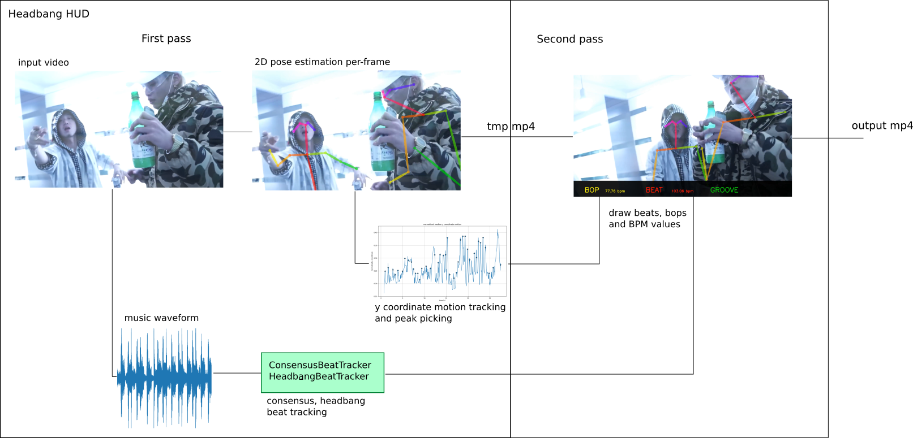

# headbang.py

headbang.py is a collection of projects related to beat tracking in metal music.

See more at https://sevagh.github.io/headbang.py

### Installation

headbang has been written and verified with Python 3.8 on an amd64 machine running Fedora 32 Linux. However, there shouldn't be any problems running it on different machines if the requirements can be successfully installed.

The only sticking point is that the [BTrack](https://github.com/adamstark/BTrack) package is not on pip, and needs to be installed manually. My [fork](https://github.com/sevagh/BTrack) supports a Python 3.8 install:

```
sevagh:~ $ git clone https://github.com/sevagh/BTrack
sevagh:~ $ cd BTrack/modules-and-plug-ins/python-module
sevagh:python-module $ python3.8 setup.py build

# install to your system
sevagh:python-module $ sudo python3.8 setup.py install

# OR #

# install for your local user
sevagh:python-module $ pip3.8 install --user -e .
```

After installing BTrack for headbang, you also need to build and install [openpose](https://github.com/CMU-Perceptual-Computing-Lab/openpose) from source. I followed the instructions for building and installing the Python module successfully on Python 3.7, Fedora 32, amd64 with no issues.

### Beat tracking algorithm


### Beat tracking usage

Headbang consists of:
* [ConsensusBeatTracker](https://github.com/sevagh/headbang.py/blob/master/headbang/consensus.py#L49) and [HeadbangBeatTracker](https://github.com/sevagh/headbang.py/blob/master/headbang/headbang.py#L35)
  ```python
  import multiprocessing
  import librosa

  from headbang.consensus import ConsensusBeatTracker
  from headbang import HeadbangBeatTracker

  pool = multiprocessing.Pool()

  x, fs = librosa.load('mysongwithbeats.wav')
  cbt = ConsensusBeatTracker(pool)
  hbt = HeadbangBeatTracker(pool)

  cbt_beats = cbt.beats(x)
  hbt_beats = hbt.beats(x)
  ```
* [`headbang-beats`](./headbang/beat_tool.py), which implements all of the parameters of the consensus and headbang beat trackers in command-line arguments, loads an audio file, gets beat locations, and outputs an audio file with clicks on the beat locations.

### HUD usage

[headbang-hud](./headbang/hud_tool.py) is a combined MIR beat tracking and 2D pose estimation project for tracking beats and headbanging motion in videos with music (concert footage, covers, music videos, etc.):


