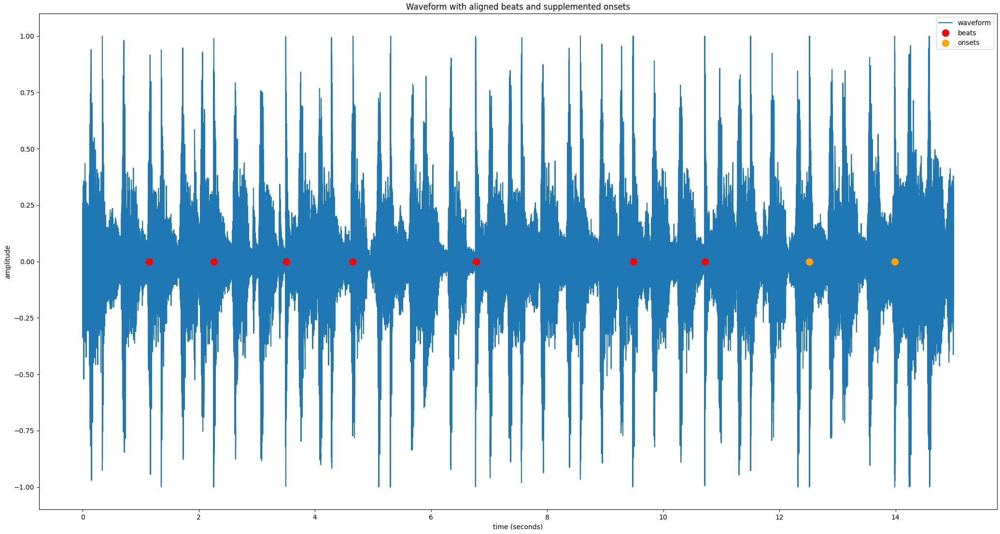

# headbang.py

headbang.py is a collection of beat-tracking related projects, exploring beat tracking and the phenomenon of headbanging in metal music. It is presented as my final project for MUMT 621 Music Information Retrieval, and it consists of:

* headbang: a Python library implementing beat tracking for fully mixed percussive metal songs
    * `ConsensusBeatTracker` is  a beat-tracking ensemble algorithm that combines the outputs of 6 different beat trackers
    * `HeadbangBeatTracker` is a beat-tracking meta-algorithm that aligns the outputs of the consensus beat tracker with strong percussive onsets
* headbang-hud: a Python script which analyzes MP4 videos and uses 2D pose estimation to track head motion and headbang peaks to display alongside beat tracking results

Instructions for how to install the dependencies and run the various scripts and components are in [the source code's README](https://github.com/sevagh/headbang.py). Feel free to post any questions, concerns, or contributions via GitHub issues.

## Headbang, a beat tracking library for fully-mixed metal

The original motivation of `HeadbangBeatTracker` was to only predict beats that aligned with strong percussive onsets. The most common form of beat tracking output is overlaying clicks on the input audio track - in my opinion, it is very displeasing when the click is wrong. `HeadbangBeatTracker` is focused on eliminating false positives, and will output much fewer "strong beats" than the underlying beat trackers.

For example, during a segment of the song where there is a lull and the drums are silent, there may be a silent/implicit beat, but `HeadbangBeatTracker` will not emit any clicks. The code has been tested mostly on prog metal and djent - Vitalism, Kadinja, Periphery, Anup Sastry, Meshuggah, Animals as Leaders, etc. As there are no ground truth annotations for such music, all of the testing and verification was done manually by yours truly, with some helper scripts - the workflow will be described later on.

### Algorithm 1 - ConsensusBeatTracker

The first algorithm of the `headbang` library is a consensus/ensemble beat tracker, implemented in the `ConsensusBeatTracker` class. The following visuals describe how the algorithm works at a high level:

**Input** is provided as a single audio file containing the full-length metal song:


Note that the plots are generated with a small segment (15s) extracted from a full song to demonstrate the algorithm more clearly. For best beat results, it's better to pass in the full song. I've tested a range of 3-16-minute songs with accurate tracking throughout. A small, isolated segment of a song will generally lead to bad beat tracking results.

**Multiple beat tracking algorithms** are applied on the input directly (without preprocessing):


The list of beat trackers consist of:
1. [madmom](https://madmom.readthedocs.io/en/latest/modules/features/beats.html) RNNBeatProcessor -> DBNBeatTrackingProcessor
2. madmom RNNBeatProcessor -> BeatDetectionProcessor
3. [Essentia BeatTrackerMultiFeature](https://essentia.upf.edu/reference/std_BeatTrackerMultiFeature.html)
4. [Essentia BeatTrackerDegara](https://essentia.upf.edu/reference/std_BeatTrackerDegara.html)
5. [librosa beat_track](https://librosa.org/doc/latest/generated/librosa.beat.beat_track.html)
6. [BTrack](https://github.com/adamstark/BTrack)

The list can be controlled via the `algorithms="1,2,3,4,5,6"` argument.

These are executed in parallel using Python's [multiprocessing](https://docs.python.org/3/library/multiprocessing.html) module. The code is designed to be executed by the pool [`starmap`](https://docs.python.org/3/library/multiprocessing.html#multiprocessing.pool.Pool.starmap) pool function:
```python
def apply_single_beattracker(x, algo):
    beats = None
    if algo == 1:
        beats = algo1(x, ...)
    elif algo == 2:
        beats = algo2(x, ...)
    ...

    return beats

def apply_consensus(x):
    all_algos = [1, 2, 3, 4, 5, 6, 7, 8]
    all_results = pool.starmap(
            apply_single_beattracker,
            zip(itertools.repeat(x), all_algos)
    )
```

This results in the following executions invoked in parallel on the input signal `x`:
```python
apply_single_beattracker(x, 1)
apply_single_beattracker(x, 2)
...
```

**Consensus** of these beats is taken with [essentia's TempoTapMaxAgreement](https://essentia.upf.edu/reference/std_TempoTapMaxAgreement.html):

Previously, I invented my own consensus algorithm using numpy, by counting beat locations from different algorithms that were within a threshold of each other and had sufficient agreement. I discovered through trial and error that TempoTapMaxAgreement did a much better job:


At this point, these are usable outputs of the standalone **ConsensusBeatTracker** class. The post-processing is optional (but it helps for trickier songs).

### Algorithm 2 - HeadbangBeatTracker

The HeadbangBeatTracker first gathers beats using the ConsensusBeatTracker, and then applies post-processing for percussive onset alignment.

**Percussion is separated** from the input signal with [median-filtering Harmonic-Percussive Source Separation](https://librosa.org/doc/0.8.0/generated/librosa.decompose.hpss.html):


**Transients are enhanced** using my [multi-band transient enhancer](https://gitlab.com/sevagh/multiband-transient-shaper), which is an adaptation of the SPL differential envelope transient shaper[[1]](#1).

This enhances the percussive attacks and gates sustained/steady-state sounds, making a more sparse "drum hit waveform":


**Onset detection** is performed using a combination of 2 onset detection functions, hfc, and rms (from [Essentia](https://essentia.upf.edu/reference/streaming_OnsetDetection.html)), weighted most heavily on hfc for percussive event detection:


**Beats are aligned with percussive onsets**, to eliminate predicted beats that don't fall on a percussive attack.

Beats and onsets that lie within `onset_align_threshold_s=0.07` seconds of each are considered aligned:


**Sections with no beats are supplemented with percussive onsets**

The final step verifies that there are any long gaps with no beats (`max_no_beats=1`). If there are gaps, percussive onsets are inserted. It's assumed that the beat trackers "got confused" and that it's better to fall back to strong percussive attacks to maintain a click continuity.

If the song truly contains no drum hits during that period, then there are no percussive onsets either, so headbang.py maintains the necessary silence.

The final waveform contains consensus beats supplemented with extra percussive onsets:



This is the final output of the **HeadbangBeatTracker**.

### MIREX-inspired evaluation and results

I evaluated headbang's `ConsensusBeatTracker` against the MIREX SMC12 dataset[[2]](#2), using the [mir_eval](https://github.com/craffel/mir_eval) library[[3]](#3). [MIREX 2019](https://www.music-ir.org/mirex/wiki/2019:MIREX2019_Results) is the most recent year of the audio beat tracking challenge (2020 results are not ready yet).

The summary of MIREX 2019 results on the SMC dataset is:


To anchor my own evaluation to the above, I will include results for the consensus beat tracker alongside the madmom [DBNBeatTracker](https://github.com/CPJKU/madmom/blob/master/bin/DBNBeatTracker)[[4]](#4), or SB1 in the above table. Note that this beat tracker is among the 8 used in my consensus algorithm.

The 4 measures that will be evaluated (F-measure, Cemgil, Goto, and McKinney P-Score) are the same as those used in MIREX, and are borrowed from the [Beat Evaluation Toolbox](https://code.soundsoftware.ac.uk/projects/beat-evaluation/)[[5]](#5).

An additional 2 measures were added by splitting the F-measure into its constituent precision and recall (simply by copy-pasting the mir_eval f_measure function and returning the individual measures).

This should help with a more fine-grained analysis of results. My hypothesis is that the precision of headbang.py should be higher, and the recall lower. In other words, it makes less beat predictions, due to the constraining nature of consensus and onset alignment, but the ones it does make should be very accurate.

The mir_beat_eval.py script (in the base directory of the repository) loads the SMC dataset (which you can [download here](http://smc.inesctec.pt/research/data-2/)). The SMC dataset contains wav files and ground-truth annotations. The script evaluates the results of the madmom DBNBeatTracker and every possible combination of `ConsensusBeatTracker` - e.g. out of 6 algorithms, the unique combinations are "1, 12, 123, 135, 24, 246, ..." (the default setting of `ConsensusBeatTracker` is all 6, or "123456").

The median score for each of the six measure was taken across the 218 tracks of SMC.

Output result table:

```
| algorithm   |   F-measure |     Cemgil |      Goto |   McKinney P-score |   Precision |     Recall |
|-------------|-------------|------------|-----------|--------------------|-------------|------------|
| SB1         |  0.55288    | 0.436283   | 0.225806  |         0.649583   |   0.537928  | 0.602492   |
| consensus   |  0.46131    | 0.360548   | 0.0368664 |         0.527189   |   0.411873  | 0.576754   |
```

### Perceptual evaluation and results

The above is useful for posterity, but I did the main development and testing of `headbang` with my own ears by overlaying clicks and listening to full-length metal songs continually while tweaking different parameters.

The two useful scripts are `bin/beat_track.py`, which contains command-line arguments for every setting of `ConsensusBeatTracker` and `HeadbangBeatTracker`, and `bin/reference_beats.py`, which lets us apply each of the individual algorithms separately.

The full help text of `beat_track.py` displays the extent of configuration options:
```
sevagh:headbang.py $ ./bin/beat_track.py --help
[   INFO   ] MusicExtractorSVM: no classifier models were configured by default
usage: headbang.py [-h] [--algorithms ALGORITHMS] [--onset-align-threshold-s ONSET_ALIGN_THRESHOLD_S]
                   [--max-no-beats MAX_NO_BEATS] [--onset-near-threshold-s ONSET_NEAR_THRESHOLD_S]
                   [--onset-silence-threshold ONSET_SILENCE_THRESHOLD] [--n-pool N_POOL] [--show-plots] [--disable-onsets]
                   [--beats-out BEATS_OUT] [--harmonic-margin HARMONIC_MARGIN] [--harmonic-frame HARMONIC_FRAME]
                   [--percussive-margin PERCUSSIVE_MARGIN] [--percussive-frame PERCUSSIVE_FRAME]
                   [--fast-attack-ms FAST_ATTACK_MS] [--slow-attack-ms SLOW_ATTACK_MS] [--release-ms RELEASE_MS]
                   [--power-memory-ms POWER_MEMORY_MS] [--filter-order FILTER_ORDER]
                   wav_in wav_out
```

For example, when I was evaluating different values for the harmonic frame size for HPSS, the evaluation could look something like this:
```bash
for harm_window in 256 1024 4096 16384; do
    ./bin/beat_track.py \
        --harmonic-window="$harm_window" \
        input_metal_song.wav \
        "output_metal_song_harm_window_$harm_window.wav"
done
```

Here's a table of some interesting outputs of headbang's algorithms:

| Song | madmom DBN | ConsensusBeatTracker | HeadbangBeatTracker |
|------|------------|----------------------|---------------------|
| [Tyler the Creator - Who Dat Boy](https://www.youtube.com/watch?v=NpuV825cMuA) | [whodatboy_dbn.wav](./whodatboy_dbn.wav) | [whodatboy_cbt.wav](./whodatboy_cbt.wav) | [whodatboy_hbt.wav](./whodatboy_hbt.wav) |
| [Periphery - The Bad Thing](https://www.youtube.com/watch?v=ljwwIpPbrJM) | [badthing_dbn.wav](./badthing_dbn.wav) | [badthing_cbt.wav](./badthing_cbt.wav) | [badthing_hbt.wav](./badthing_hbt.wav) |
| [Volumes - The Mixture](https://www.youtube.com/watch?v=VaE62m_a8oQ) | [themixture_dbn.wav](./themixture_dbn.wav) | [themixture_cbt.wav](./themixture_cbt.wav) | [themixture_hbt.wav](./themixture_hbt.wav) |
| [Vitalism - Luxata](https://www.youtube.com/watch?v=Pru_5HW9Ofg) | [luxata_dbn.wav](./luxata_dbn.wav) | [luxata_cbt.wav](./luxata_cbt.wav) | [luxata_hbt.wav](./luxata_hbt.wav) |

## References

<a id="1">[1]</a>
Gier, H & Paul White, "SPL Transient Designer, DUAL-CHANNEL, Model 9946, Manual"
URL: https://spl.audio/wp-content/uploads/transient_designer_2_9946_manual.pdf

<a id="2">[2]</a>
Holzapfel, A.; Davies, M.E.P.; Zapata, J.R.; Oliveira, J.L.; Gouyon, F.; , "Selective Sampling for Beat Tracking Evaluation," Audio, Speech, and Language Processing, IEEE Transactions on , vol.20, no.9, pp.2539-2548, Nov. 2012
doi: 10.1109/TASL.2012.2205244
URL: http://ieeexplore.ieee.org/stamp/stamp.jsp?tp=&arnumber=6220849&isnumber=6268383

<a id="3">[3]</a>
Böck, Sebastian & Krebs, Florian & Widmer, Gerhard. (2014). A MULTI-MODEL APPROACH TO BEAT TRACKING CONSIDERING HETEROGENEOUS MUSIC STYLES.

<a id="4">[4]</a>
Colin Raffel, Brian McFee, Eric J. Humphrey, Justin Salamon, Oriol Nieto, Dawen Liang, and Daniel P. W. Ellis, "mir_eval: A Transparent Implementation of Common MIR Metrics", Proceedings of the 15th International Conference on Music Information Retrieval, 2014.

<a id="5">[5]</a>
Matthew E. P. Davies,  Norberto Degara, and Mark D. Plumbley. "Evaluation Methods for Musical Audio Beat Tracking Algorithms", Queen Mary University of London Technical Report C4DM-TR-09-06, London, United Kingdom, 8 October 2009.
