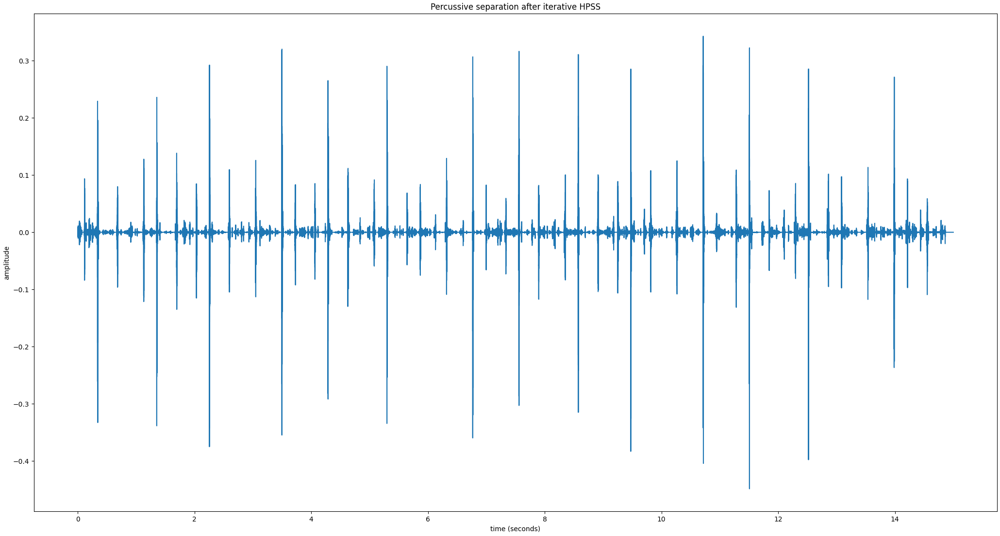

# headbang.py

headbang.py is a meta-algorithm for accurate percussive beat tracking in fully mixed progressive metal songs. It considers the consensus of multiple diverse beat and onset detectors.

The goal is to only predict beats that align with strong percussive onsets. For example, during a segment of the song where the drums are silent, there may be a silent/implicit beat, but headbang.py will not emit any predictions.

Instructions for how to install the dependencies and run headbang.py are in [the source code's README](https://github.com/sevagh/headbang.py). Feel free to post any questions, concerns, or contributions via GitHub issues.

headbang.py is a component of my final project for MUMT 621 Music Information Retrieval, Winter 2021.

## Examples

I can't include full songs due to copyright issues. Here are 3 excerpts of good outputs from headbang.py (using the default settings) on some songs:
* [Periphery - The Bad Thing](./example_bad_thing.wav) - accurate tracking during accented off-beats 

Contrast with reference (DBNBeatTracker[[4]](#4)) output: [Periphery - The Bad Thing](./example_bad_thing_dbn_ref.wav)

Note the DBN beat tracker getting confused, while headbang.py continues hitting strong percussive hits accurately.

* [Periphery - Omega](./example_omega.wav) - clicks on strong accents across a time signature/tempo transition

Contrast with reference (DBNBeatTracker) output: [Periphery - Omega](./example_omega_dbn_ref.wav)

Note the accents by headbang are on the strong pulses, or headbangs. A friend described headbang.py as a "metal snare follower". The DBNBeatTracker is emitting accurate beats, but all of them, versus the "headbang pulse".

## Algorithm

### Input

The input is provided as a single audio file containing the mixed song. This can be a full length typical metal song:


Note that the plots were generated with a small segment (10s) extracted from a full song to demonstrate the algorithm more clearly. For best beat results, it's better to pass in the full song. I've tested a range of 3-16-minute songs with accurate tracking throughout. A small, isolated segment of a song will generally lead to bad beat tracking results.

### Multiple beat tracking algorithms

8 beat trackers are applied on the input directly (without preprocessing):


The list of beat trackers is:
1. [madmom](https://madmom.readthedocs.io/en/latest/modules/features/beats.html) RNNBeatProcessor -> DBNBeatTrackingProcessor
2. madmom RNNBeatProcessor -> BeatTrackingProcessor
3. madmom RNNBeatProcessor -> CRFBeatDetectionProcessor
4. madmom RNNBeatProcessor -> BeatDetectionProcessor
5. [Essentia BeatTrackerMultiFeature](https://essentia.upf.edu/reference/std_BeatTrackerMultiFeature.html)
6. [Essentia BeatTrackerDegara](https://essentia.upf.edu/reference/std_BeatTrackerDegara.html)
7. [librosa beat_track](https://librosa.org/doc/latest/generated/librosa.beat.beat_track.html)
8. [BTrack](https://github.com/adamstark/BTrack)

These are executed in parallel using Python's [multiprocessing](https://docs.python.org/3/library/multiprocessing.html) module. The code is designed to be executed by the pool [`starmap`](https://docs.python.org/3/library/multiprocessing.html#multiprocessing.pool.Pool.starmap) pool function:
```python
def apply_single_beattracker(x, algo):
    beats = None
    if algo == 1:
        beats = algo1(x, ...)
    elif algo == 2:
        beats = algo2(x, ...)
    ...

    return beats

def apply_consensus(x):
    all_algos = [1, 2, 3, 4, 5, 6, 7, 8]
    all_results = pool.starmap(
            apply_single_beattracker,
            zip(itertools.repeat(x), all_algos)
    )
```

This results in the following executions invoked in parallel on the input signal `x`:
```python
apply_single_beattracker(x, 1)
apply_single_beattracker(x, 2)
...
```

Finally, all of the beat locations are accumulated in a sorted numpy ndarray.

### "True beats" are chosen by consensus

A true beat is marked when 4 out of the 8 beat trackers agree (i.e. `--consensus-ratio=0.5`x`len(algorithms)` predict a beat within the same `--beat-near-threshold`, by default 100ms):


This is done with numpy:

```python
# all_beats contains the beat locations output by all 8 beat trackers

good_beats = numpy.sort(numpy.unique(all_beats))

# group beats into buckets that are near each other by beat_near_threshold
grouped_beats = numpy.split(
    good_beats,
    numpy.where(numpy.diff(good_beats) > beat_near_threshold)[0] + 1,
)

# use the mean of each bucket as the final beat location of the bucket
beats = [numpy.mean(x) for x in grouped_beats]

# count the count of each bucket
tick_agreements = [len(x) for x in grouped_beats]

# include beats that have at least consensus agreements
final_beats = []
for i, tick in enumerate(beats):
    if tick_agreements[i] >= consensus:
        final_beats.append(tick)

return final_beats
```

At this point, these are usable outputs of the standalone **ConsensusBeatTracker** object. The post-processing is optional (but essential for good metal results).

### Percussive onsets

To find percussive onsets, first the percussive component of the input signal is separated with [median-filtering](https://librosa.org/doc/0.8.0/generated/librosa.decompose.hpss.html):



Then, I apply my [multi-band transient enhancer](https://gitlab.com/sevagh/multiband-transient-shaper), which is an adaptation of the SPL differential envelope transient shaper[[1]](#1), to enhance the percussive attacks and gate sustained/steady-state sounds:


Onset detection is performed using a combination of 3 onset detection functions, hfc, flux, and rms (from [Essentia](https://essentia.upf.edu/reference/streaming_OnsetDetection.html)), weighted most heavily on hfc for percussive event detection:


### Aligning beats with percussive onsets

The second-last step of the algorithm is to align the consensus beats with the percussive onset events discovered in the previous step.

This eliminates predicted beats that don't fall on a percussive attack:


### Final beats

The final step verifies that there are any long gaps with no beats (`--max-no-beats`, 2 seconds by default). If there are gaps, percussive onsets are inserted. It's assumed that the beat trackers "got confused" and that it's better to fall back to strong percussive attacks to maintain a click continuity.

If the song truly contains no drum hits during that period, then there are no percussive onsets either, so headbang.py maintains the necessary silence.

The final waveform contains consensus beats supplemented with extra percussive onsets:


These are the outputs of the **HeadbangBeatTracker**.

## Evaluation

I evaluated headbang's beat trackers against the MIREX SMC12 dataset[[2]](#2), using the [mir_eval](https://github.com/craffel/mir_eval) library[[3]](#3). [MIREX 2019](https://www.music-ir.org/mirex/wiki/2019:MIREX2019_Results) is the most recent year of the audio beat tracking challenge (2020 results are not ready yet).

The summary of MIREX 2019 results on the SMC dataset is:


To anchor my own evaluation to the above, I will include results for the consensus beat tracker alongside the madmom [DBNBeatTracker](https://github.com/CPJKU/madmom/blob/master/bin/DBNBeatTracker)[[4]](#4), or SB1 in the above table. Note that this beat tracker is among the 8 used in my consensus algorithm.

From headbang (this library), I'll be evaluating the base ConsensusBeatTracker and the final HeadbangBeatTracker (with percussive onset alignment).

The 4 measures that will be evaluated (F-measure, Cemgil, Goto, and McKinney P-Score) are the same as those used in MIREX, and are borrowed from the [Beat Evaluation Toolbox](https://code.soundsoftware.ac.uk/projects/beat-evaluation/)[[5]](#5).

An additional 2 measures were added by splitting the F-measure into its constituent precision and recall (simply by copy-pasting the mir_eval f_measure function and returning the individual measures).

This should help with a more fine-grained analysis of results. My hypothesis is that the precision of headbang.py is higher, but the recall is lower. In other words, it makes less beat predictions, due to the constraining nature of consensus and onset alignment, but the ones it does make should be very accurate. This is a personal taste - perceptually, I prefer silence to an incorrect beat location.

## Results

The mir_beat_eval.py script (in the base directory of the repository) loads the SMC dataset (which you can [download here](http://smc.inesctec.pt/research/data-2/)). The SMC dataset contains wav files and ground-truth annotations. The script evaluates the results of ConsensusBeatTracker, HeadbangBeatTracker, and the madmom DBNBeatTracker.

The median score for each of the six measure was taken across the 218 tracks of SMC.

Output result table:

```
| algorithm   |   F-measure |   Cemgil |      Goto |   McKinney P-score |
|-------------|-------------|----------|-----------|--------------------|
| SB1         |    0.55288  | 0.436248 | 0.225806  |           0.649583 |
| consensus   |    0.461467 | 0.36056  | 0.0368664 |           0.527321 |
```

## Discussion

 and repeating the testbench:


### References

<a id="1">[1]</a>
Gier, H & Paul White, "SPL Transient Designer, DUAL-CHANNEL, Model 9946, Manual"
URL: https://spl.audio/wp-content/uploads/transient_designer_2_9946_manual.pdf

<a id="2">[2]</a>
Holzapfel, A.; Davies, M.E.P.; Zapata, J.R.; Oliveira, J.L.; Gouyon, F.; , "Selective Sampling for Beat Tracking Evaluation," Audio, Speech, and Language Processing, IEEE Transactions on , vol.20, no.9, pp.2539-2548, Nov. 2012
doi: 10.1109/TASL.2012.2205244
URL: http://ieeexplore.ieee.org/stamp/stamp.jsp?tp=&arnumber=6220849&isnumber=6268383

<a id="3">[3]</a>
Böck, Sebastian & Krebs, Florian & Widmer, Gerhard. (2014). A MULTI-MODEL APPROACH TO BEAT TRACKING CONSIDERING HETEROGENEOUS MUSIC STYLES.

<a id="4">[4]</a>
Colin Raffel, Brian McFee, Eric J. Humphrey, Justin Salamon, Oriol Nieto, Dawen Liang, and Daniel P. W. Ellis, "mir_eval: A Transparent Implementation of Common MIR Metrics", Proceedings of the 15th International Conference on Music Information Retrieval, 2014.

<a id="5">[5]</a>
Matthew E. P. Davies,  Norberto Degara, and Mark D. Plumbley. "Evaluation Methods for Musical Audio Beat Tracking Algorithms", Queen Mary University of London Technical Report C4DM-TR-09-06, London, United Kingdom, 8 October 2009.
