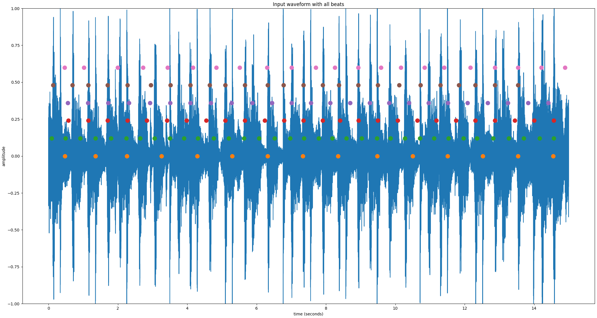
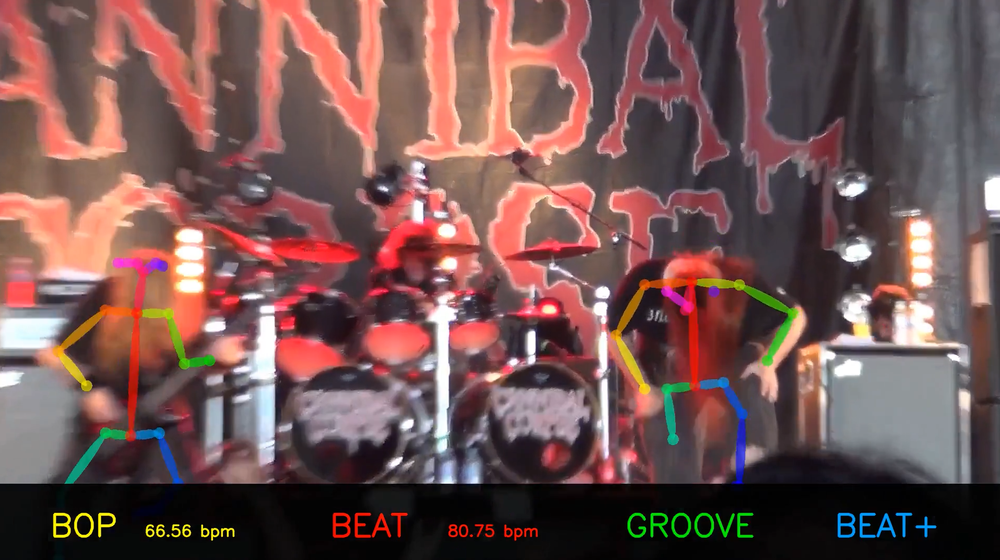

# headbang.py

* TOC
{:toc}

## Introduction

headbang.py is a collection of beat-tracking related projects, exploring beat tracking and the phenomenon of headbanging in metal music. It is presented as my final project for MUMT 621 Music Information Retrieval, and it consists of:

* headbang: a Python library implementing beat tracking for fully mixed percussive metal songs
    * `ConsensusBeatTracker` is  a beat-tracking ensemble algorithm that combines the outputs of 6 different beat trackers
    * `HeadbangBeatTracker` is a beat-tracking meta-algorithm that aligns the outputs of the consensus beat tracker with strong percussive onsets
* headbang-beats: a Python tool for applying various configurations of the headbang beat tracking algorithms
* headbang-hud: a Python tool which analyzes MP4 videos and uses 2D pose estimation to track head motion and headbang peaks to display alongside beat tracking results
* headbang-viz: a Python tool which creates an animation for the consensus beat tracking algorithm

Instructions for how to install the dependencies and run the various scripts and components are in [the source code's README](https://github.com/sevagh/headbang.py).

Post any questions, concerns, or contributions via GitHub issues.

# headbang-beats: beat tracking algorithms for fully-mixed prog metal

The original motivation of `HeadbangBeatTracker` was to only predict beats that aligned with strong percussive onsets. The most common form of beat tracking output is overlaying clicks on the input audio track - in my opinion, it is very displeasing when the click is wrong. `HeadbangBeatTracker` is focused on eliminating false positives, and will output much fewer "strong beats" than the underlying beat trackers.

For example, during a segment of the song where there is a lull and the drums are silent, there may be a silent/implicit beat, but `HeadbangBeatTracker` will not emit any clicks. The code has been tested mostly on prog metal and djent - Vitalism, Kadinja, Periphery, Anup Sastry, Meshuggah, Animals as Leaders, etc. As there are no ground truth annotations for such music, all of the testing and verification was done manually by yours truly, with some helper scripts - the workflow will be described later on.

## Block diagram

Both ConsensusBeatTracker and HeadbangBeatTracker are _offline_, or non-realtime, algorithms. They need access to the whole song.


## Algorithm 1 - ConsensusBeatTracker

The first algorithm of the `headbang` library is a consensus/ensemble beat tracker, implemented in the `ConsensusBeatTracker` class. The following visuals describe how the algorithm works at a high level. All plots were generated with [matplotlib](https://matplotlib.org/).

**Input** is provided as a single audio file containing the full-length metal song:


Note that the plots are generated with a small segment (15s) extracted from a full song to demonstrate the algorithm more clearly. For best beat results, it's better to pass in the full song. I've tested a range of 3-16-minute songs with accurate tracking throughout. A small, isolated segment of a song will generally lead to bad beat tracking results.

**Multiple beat tracking algorithms** are applied on the input directly (without preprocessing):



The list of beat trackers consist of:
1. [madmom](https://madmom.readthedocs.io/en/latest/modules/features/beats.html) RNNBeatProcessor[[1]](#1) -> DBNBeatTrackingProcessor[[2]](#2)
2. madmom RNNBeatProcessor -> BeatDetectionProcessor[[3]](#3)
3. [Essentia](https://essentia.upf.edu/reference/std_BeatTrackerMultiFeature.html) BeatTrackerMultiFeature[[4]](#4)
4. [Essentia](https://essentia.upf.edu/reference/std_BeatTrackerDegara.html) BeatTrackerDegara[[5]](#5)
5. [librosa](https://librosa.org/doc/latest/generated/librosa.beat.beat_track.html) beat_track[[6]](#6)
6. [BTrack](https://github.com/adamstark/BTrack)[[7]](#7)

These are executed in parallel using Python's [multiprocessing](https://docs.python.org/3/library/multiprocessing.html) module. The code is designed to be executed by the pool [`starmap`](https://docs.python.org/3/library/multiprocessing.html#multiprocessing.pool.Pool.starmap) pool function:
```python
def apply_single_beattracker(x, algo):
    beats = None
    if algo == 1:
        beats = algo1(x, ...)
    elif algo == 2:
        beats = algo2(x, ...)
    ...

    return beats

def apply_consensus(x):
    all_algos = [1, 2, 3, 4, 5, 6, 7, 8]
    all_results = pool.starmap(
            apply_single_beattracker,
            zip(itertools.repeat(x), all_algos)
    )
```

This results in the following executions invoked in parallel on the input signal `x`:
```python
apply_single_beattracker(x, 1)
apply_single_beattracker(x, 2)
...
```

The beat trackers can be controlled via the `algorithms="1,2,3,4,5,6"` parameter.

**Consensus** of these beats is taken with [essentia's TempoTapMaxAgreement](https://essentia.upf.edu/reference/std_TempoTapMaxAgreement.html)[[8]](#8)

Previously, I invented my own consensus algorithm using numpy, by counting beat locations from different algorithms that were within a threshold of each other and had sufficient agreement. I discovered through trial and error that TempoTapMaxAgreement did a much better job:


At this point, these are usable outputs of the standalone **ConsensusBeatTracker** class. The post-processing is optional (but it helps for trickier songs).

## Algorithm 2 - HeadbangBeatTracker

The HeadbangBeatTracker first gathers beats using the ConsensusBeatTracker, and then applies post-processing for percussive onset alignment. To disable the onset alignment and return the consensus results only, set the parameter `disable_onsets=True`.

**Percussion is separated** from the input signal with Harmonic-Percussive Source Separation:


The algorithm used is one based on median filtering the spectrogram, originally described in [[9]](#9), and further improved with an iterative algorithm in [[10]](#10). I use the [librosa implementation](https://librosa.org/doc/0.8.0/generated/librosa.decompose.hpss.html), which has a good visualization of the effect.

The parameters of the HPSS can be modified (but I don't find it changes the results significantly):
* `harmonic_frame=16384` (a larger frame size in the first iteration gives us higher frequency resolution which helps separate pitched, harmonic components)
* `harmonic_margin=2.3` (how strong the separation is)
* `percussive_frame=256` (a smaller frame size in the second iteration gives us higher time resolution which helps separate short, sharp percussive events)
* `percussive_margin=2.3`

**Transients are enhanced** using a differential-envelope transient enhancer adapted from the SPL differential envelope transient shaper[[11]](#11). This enhances the percussive attacks and gates sustained/steady-state sounds, making a more sparse "drum hit waveform":


The parameters for the transient enhancer can be modified, but are not likely to change your results drastically (similar to HPSS):
* `fast_attack_ms=1`
* `slow_attack_ms=15`
* `release_ms=20`
* `power_memory_ms=1`
* `filter_order=3`

Reading through one of my previous projects, [multiband-transient-shaper](https://gitlab.com/sevagh/multiband-transient-shaper), or the [SPL design manual](https://spl.audio/wp-content/uploads/transient_designer_2_9946_manual.pdf) should help shed some light on those parameters - or, if you have audio production/recording experience, you may recognize those parameters from dynamic range compressors/expanders/noise gates - but much of it was discovered through trial and error.

**Onset detection** is performed using a combination of 2 onset detection functions, HFC[[12]](#12), and RMS[[13]](#13) (from [Essentia](https://essentia.upf.edu/reference/streaming_OnsetDetection.html)), weighted most heavily on HFC for percussive event detection:


**Beats are aligned with percussive onsets**, to eliminate predicted beats that don't fall on a percussive attack. Beats and onsets that lie within `onset_align_threshold_s=0.07` seconds of each are considered aligned:


The value of 0.07 was inspired by [mir_eval](https://github.com/craffel/mir_eval/blob/master/mir_eval/beat.py#L138), which uses a window of 0.07 seconds to consider two beats to be equivalent events (when evaluating beat tracking results of an algorithm vs. the ground truth annotations).

**Sections with no beats are supplemented with percussive onsets**

The final step verifies that there are any long gaps with no beats (`max_no_beats=1`). If there are gaps, percussive onsets are inserted. It's assumed that the beat trackers "got confused" and that it's better to fall back to strong percussive attacks to maintain a click continuity.

If the song truly contains no drum hits during that period, then there are no percussive onsets either, so `HeadbangBeatTracker` maintains the necessary silence.

There is a parameter `onset_near_threshold_s=0.35`, which controls how far onsets must be spaced apart to be substituted for beats. Sometimes, there is a quick succession of percussive onsets, but I don't want to hear clicks too close together.

The final waveform contains consensus beats supplemented with extra percussive onsets:


This is the final output of the **HeadbangBeatTracker**.

## Perceptual evaluation

I did the main development and testing of `headbang` with my own ears by overlaying clicks and listening to full-length metal songs continually while tweaking different parameters.

The useful tool is `headbang-beats`, which contains command-line arguments for every constructor parameter of `ConsensusBeatTracker` and `HeadbangBeatTracker`. Further, by only specifying one algorithm (e.g. `--algorithms=1`) and disabling onset alignment (`--disable-onsets`), we can apply single algorithms at a time as a reference.

The full help text of `headbang-beats` displays the extent of configuration options:
```
usage: headbang-beat-tool [-h] [--algorithms ALGORITHMS]
                          [--onset-align-threshold-s ONSET_ALIGN_THRESHOLD_S]
                          [--max-no-beats MAX_NO_BEATS]
                          [--onset-near-threshold-s ONSET_NEAR_THRESHOLD_S]
                          [--onset-silence-threshold ONSET_SILENCE_THRESHOLD]
                          [--n-pool N_POOL] [--show-plots] [--disable-onsets]
                          [--disable-transient-shaper] [--beats-out BEATS_OUT]
                          [--harmonic-margin HARMONIC_MARGIN]
                          [--harmonic-frame HARMONIC_FRAME]
                          [--percussive-margin PERCUSSIVE_MARGIN]
                          [--percussive-frame PERCUSSIVE_FRAME]
                          [--fast-attack-ms FAST_ATTACK_MS]
                          [--slow-attack-ms SLOW_ATTACK_MS]
                          [--release-ms RELEASE_MS]
                          [--power-memory-ms POWER_MEMORY_MS]
                          [--filter-order FILTER_ORDER]
                          wav_in wav_out
```

For example, when I was evaluating different values for the harmonic frame size for HPSS, the evaluation could look something like this:
```bash
for harm_frame in 256 1024 4096 16384; do
    headbang-beats \
        --harmonic-frame=$harm_frame \
        input_metal_song.wav \
        output_metal_song_harm_frame_$harm_frame.wav
done
```

Using comparisons of reference beats, I was able to pare down the original list of 8 algorithms in the consensus down to 6. Madmom's BeatTrackingProcessor and CRFBeatDetectionProcessor were eliminated, both of which I found to produce poor results (on my custom testbench) on their own, indicating that they were not useful members of the consensus.

### Results

Here's a table of some interesting outputs of headbang's algorithms:
<table>
  <tbody>
    <tr>
      <th align="left">Song</th>
      <th align="left">madmom DBN</th>
      <th align="left">Headbang</th>
    </tr>
    <tr>
      <td><a href="https://www.youtube.com/watch?v=NpuV825cMuA">Tyler the Creator - Who Dat Boy</a></td>
      <td></td>
      <td></td>
    </tr>
    <tr>
      <td><a href="https://www.youtube.com/watch?v=ljwwIpPbrJM">Periphery - The Bad Thing</a></td>
      <td></td>
      <td></td>
    </tr>
    <tr>
      <td><a href="https://www.youtube.com/watch?v=VaE62m_a8oQ">Volumes - The Mixture</a></td>
      <td></td>
      <td></td>
    </tr>
    <tr>
      <td><a href="https://www.youtube.com/watch?v=8niG0ta4jZs">Anup Sastry - Origin</a></td>
      <td></td>
      <td></td>
    </tr>
    <tr>
      <td><a href="https://www.youtube.com/watch?v=62D2d7ZWyxA">Periphery - Eureka</a></td>
      <td></td>
      <td></td>
    </tr>
    <tr>
      <td><a href="https://www.youtube.com/watch?v=8saKHKt1A5Q">Animals as Leaders - Lippincott</a></td>
      <td></td>
      <td></td>
    </tr>
  </tbody>
</table>

### Execution time

HeadbangBeatTracker is resource-intensive - beyond applying 6 beat tracking algorithms in parallel, it performs harmonic-percussive source separation, parallelized subband transient shaping across 24 Bark bands, parallelized computation of HFC and RMS onsets, and onset detection - lots of work.

Here are some execution times on a 3 minute 25 second song:

```
# madmom DBN (with slight overhead compared to the bare code due to performing a multiprocessing "consensus of one"
$ time headbang-beats --algorithms=1 --disable-onsets testcases/hbt/whodatboy.opus testcases/dbn-results/whodatboy.wav
real    0m33.949s
user    0m37.078s
sys     0m12.257s

# consensus beat tracker (no percussive onset alignment)
# limited by its slowest beat tracker - 6 total beat trackers in parallel
$ time headbang-beats --disable-onsets testcases/hbt/whodatboy.opus testcases/hbt-results/whodatboy.wav
real    0m39.553s
user    3m36.392s
sys     0m45.846s

# headbang beat tracker
# 6 beat trackers + percussive onset alignment stage
$ time headbang-beats testcases/hbt/whodatboy.opus testcases/hbt-results/whodatboy.wav
real    2m56.605s
user    21m48.924s
sys     0m57.042s
```

## MIREX-inspired evaluation and results

I evaluated headbang's `ConsensusBeatTracker` against the MIREX SMC12 dataset[[14]](#14), using the [mir_eval](https://github.com/craffel/mir_eval) library[[15]](#15). [MIREX 2019](https://www.music-ir.org/mirex/wiki/2019:MIREX2019_Results) is the most recent year of the audio beat tracking challenge (2020 results are not ready yet).

The summary of MIREX 2019 results on the SMC dataset is:


To anchor my own evaluation to the above, I will include results for the consensus beat tracker alongside the madmom [DBNBeatTracker](https://github.com/CPJKU/madmom/blob/master/bin/DBNBeatTracker)[[2]](#2), or SB1 in the above table. Note that this beat tracker is among the 8 used in my consensus algorithm.

The 4 measures that will be evaluated (F-measure, Cemgil, Goto, and McKinney P-Score) are the same as those used in MIREX, and are borrowed from the [Beat Evaluation Toolbox](https://code.soundsoftware.ac.uk/projects/beat-evaluation/)[[16]](#16).

An additional 2 measures were added by splitting the F-measure into its constituent precision and recall (simply by copy-pasting the mir_eval f_measure function and returning the individual measures). This should help with a more fine-grained analysis of results. My hypothesis is that the precision of `ConsensusBeatTracker` could be higher at the expense of recall. In other words, it makes less beat predictions, due to the constraining nature of consensus, but the ones it does make should be very accurate.

The mir_beat_eval.py script (in the `tests/` directory of the repository) loads the SMC dataset (which you can [download here](http://smc.inesctec.pt/research/data-2/)). The SMC dataset contains wav files and ground-truth annotations. The script evaluates the results of the madmom DBNBeatTracker and every possible combination of `ConsensusBeatTracker` out of the 6 individual beat tracking algorithms:

```python
>>> algos = [1, 2, 3, 4, 5, 6]
>>> for x in range(len(algos)):
...     print([x for x in itertools.combinations(algos, x+1)])
...
[(1,), (2,), (3,), (4,), (5,), (6,)]
[(1, 2), (1, 3), (1, 4), (1, 5), (1, 6), (2, 3), (2, 4), (2, 5), (2, 6), (3, 4), (3, 5), (3, 6), (4, 5), (4, 6), (5, 6)]
[(1, 2, 3), (1, 2, 4), (1, 2, 5), (1, 2, 6), (1, 3, 4), (1, 3, 5), (1, 3, 6), (1, 4, 5), (1, 4, 6), (1, 5, 6), (2, 3, 4), (2, 3, 5), (2, 3, 6), (2, 4, 5), (2, 4, 6), (2, 5, 6), (3, 4, 5), (3, 4, 6), (3, 5, 6), (4, 5, 6)]
[(1, 2, 3, 4), (1, 2, 3, 5), (1, 2, 3, 6), (1, 2, 4, 5), (1, 2, 4, 6), (1, 2, 5, 6), (1, 3, 4, 5), (1, 3, 4, 6), (1, 3, 5, 6), (1, 4, 5, 6), (2, 3, 4, 5), (2, 3, 4, 6), (2, 3, 5, 6), (2, 4, 5, 6), (3, 4, 5, 6)]
[(1, 2, 3, 4, 5), (1, 2, 3, 4, 6), (1, 2, 3, 5, 6), (1, 2, 4, 5, 6), (1, 3, 4, 5, 6), (2, 3, 4, 5, 6)]
[(1, 2, 3, 4, 5, 6)]
```

The median score for each of the six measure was taken across the 218 tracks of SMC.

### Results

For brevity, the results for all combinations are omitted (but available in the repo). Most notable is that some combinations of consensus managed to get a higher Goto score than the MIREX 2019 winner on its own:

| algorithm           |   F-measure |    Cemgil |      Goto  |   McKinney P-score |   Precision |    Recall |
|---------------------|-------------|-----------|------------|--------------------|-------------|-----------|
| SB1                 |   0.547121  |  0.436283 |   0.225806 |           0.649256 |   0.532478  |  0.596155 |
| consensus1,2,5      |   0.537942  |  0.42607  |   0.24424  |           0.6466   |   0.526321  |  0.582903 |
| consensus1,2,4,5,6  |   0.534229  |  0.422364 |   **0.248848** |           0.646149 |   0.520878  |  0.582347 |
| consensus1,2,3,6    |   0.532419  |  0.422973 |   **0.248848** |           0.637248 |   0.516854  |  0.585059 |
| consensus1,2,3,5    |   0.529991  |  0.417679 |   0.24424  |           0.637775 |   0.514784  |  0.582063 |

# headbang-hud: combining MIR and 2D pose estimation

The goal of headbang-hud to analyze videos that contain metal music (e.g. metal concerts or guitar covers) and at least one human subject (musician, audience, or otherwise) who is headbanging (moving their head and neck vertically and vigorously on the beat). The HUD will draw the following information over the original video:

* OpenPose tracked keypoints per frame, drawn on the people
* <span style="background-color: #000000"><span style="color: #FFFF00">**BOP**</span></span>: head motion peaks, or headbangs , and associated tempo (in bpm)
* <span style="background-color: #000000"><span style="color: #FF0000">**BEAT**</span></span>: beat outputs of `ConsensusBeatTracker`, and associated tempo (in bpm)
* <span style="background-color: #000000"><span style="color: #00FF00">**GROOVE**</span></span>: when a BOP and a BEAT hit at the same time (or within `--event-threshold-frames` of each other), the music _grooves_
* <span style="background-color: #000000"><span style="color: #00A5FF">**BEAT+**</span></span>: beat outputs of `HeadbangBeatTracker`



Here's a demo from a live [Periphery concert](https://www.youtube.com/watch?v=vlL-Q_IDOm8):


The hypothesis is that certain parts of songs are so groovy that they impel either the musician or the audience (or both) to headbang on the beat. If these moments can be identified and displayed alongside MIR beat tracking, they could give us insight into the relation of headbanging to beats.

`headbang-hud` is a tool installed alongside `headbang-beats` as part of the overall [headbang.py](https://github.com/sevagh/headbang.py) project. Like `headbang-beats`, it is configurable through the command-line arguments:

```
usage: headbang-hud [-h] [--keypoints KEYPOINTS]
                    [--bpm-history BPM_HISTORY]
                    [--event-threshold-frames EVENT_THRESHOLD_FRAMES]
                    [--debug-motion]
                    [--debug-bpm]
                    [--experimental-wav-out EXPERIMENTAL_WAV_OUT]
                    [--experimental-bop-align EXPERIMENTAL_BOP_ALIGN]
                    [--experimental-sick-chain-boundary EXPERIMENTAL_SICK_CHAIN_BOUNDARY]
                    [--experimental-sick-chain]
                    mp4_in mp4_out
```

## Groove

"Whenever listeners have the impulsion to bob their heads in synchrony with music, the groove phenomenon is at work."[[24]](#24)

headbang-hud started off with the name "groove-dashboard", inspired by this paper[[17]](#17), which associates audio signal features or MIR features to human judgements of groove. The paper defines groove as follows:

>The experience of groove is associated with the urge to move to a musical rhythm

From this definition I was inspired to look towards the field of computer vision and pose estimation to track headbanging head motion. Strong beats are also associated with groove[[18]](#18), [[19]](#19), which ties in to the two beat tracking algorithms described previously.

## 2D motion with OpenPose

The motion estimation component was inspired by the preprinted paper [[20]](#20), at a high level. That paper analyzes beat synchrony of salsa dancers' foot motion. The ideas borrowed were to:
* Use OpenPose to get 2D coordinates for detected keypoints of the body parts of interest
* Normalize the coordinates
* Record the normalized coordinates per frame of the video
* Use peak picking to estimate peaks in motion

[OpenPose](https://github.com/CMU-Perceptual-Computing-Lab/openpose) is a "real-time multi-person keypoint detection library for body, face, hands, and foot estimation"[[21]](#21), written in C++, along with a Python wrapper. When you pass a frame of a video through OpenPose, it returns the detected human pose keypoints and a copy of the frame with the keypoints drawn over it:

[](https://www.youtube.com/watch?v=DPC9erC5WqU)

In this project, OpenPose is configured to use the BODY_25 model, which is their fastest performing pose detector. The keypoints of BODY_25 are defined as follows:


### Pose preprocessing

The calculation of head motion and peaks uses the returned (x, y) coordinates, which contains the position of each keypoint per frame. The keypoints `[0, 15, 16, 17, 18]` correspond to the nose, right eye, left eye, right ear, and left ear respectively. Only the y coordinate is considered, since side-to-side motion is less typical in headbanging.

Interestingly, even though typically the _bottom_ of the headbanging motion, or the valley, is supposed to coincide with the perceived beat, considering valleys instead of peaks (either through specialized valley-finding algorithms, or by using peak picking with an inverted y coordinate curve), led to totally unusable results. There could be some relation to some delay of motion and perceived auditory beat, which is naturally accounted for by considering the top of the arc of motion rather than the bottom.

The following tricky situations were encountered in different testcases:
* OpenPose will return multiple sets of keypoints, one for each detected person in the frame. The first naive approach was to only consider the first detected object; this didn't always work because it's possible that the other people in the frame are the ones headbanging, not necessarily the first. The solution was to take the median y coordinate motion across (and limited to) the first 3 objects in the frame. This way, even if the first object is stationary, the y coordinate curve would display the motion of the (possible) next 2 objects.
    ```python
    # collect (x, y) coordinates of the head, median across the first object_limit objects
    for detected_poses in multiple_detected_poses[
        : OpenposeDetector.object_limit
    ]:
        for keypoint, d in enumerate(detected_poses):
            if (
                keypoint in self.keypoints
                and d[2] > OpenposeDetector.min_confidence
            ):
                poses_of_interest.append((d[0], d[1]))
    
    poses_of_interest = numpy.asarray(poses_of_interest)
    median_coords = numpy.median(poses_of_interest, axis=0)
    ```
    Note that `object_limit` is a fixed class-level variable, not configurable by the user. I found any measurements for more than 3 objects to be impractical and unstable.
* The tracked object may disappear from frame to frame (due to shaky/unstable camera footage, etc.). The solution was to initialize an array of y coordinates for each frame of the video with NaN values, and replace the NaN with a well-defined y coordinate if it was available.

Finally, the median y coordinate across the first 3 objects is normalized by the size of the video to produce a single value in the range of [0, 1.0]. In this way, for every frame of the video, we have the median normalized y coordinate of the head and face region of at least 3 people, which should correspond to headbanging motion.

### Peak picking

From the y coordinates accumulated from all of the video frames, [scipy find_peaks_cwt](https://docs.scipy.org/doc/scipy/reference/generated/scipy.signal.find_peaks_cwt.html) is applied in the following code, with parameters and additional smoothing chosen to produce the best results in the observed testcases:

```python
def find_peaks(self):
    min_coord = numpy.nanmin(self.all_y_coords)
    adjusted_y_coords = numpy.nan_to_num(self.all_y_coords, nan=min_coord)

    # wavelets are good for peaks
    # https://www.ncbi.nlm.nih.gov/pmc/articles/PMC2631518/
    peaks = find_peaks_cwt(adjusted_y_coords, numpy.arange(2, 4))
    peaks = peaks[numpy.where(numpy.diff(peaks) > 11)[0]]
    return peaks
```

First, the NaN values in the y coordinate vector are replaced with the minimum y coordinate position seen. The values of `(2, 4)` in `find_peaks_cwt` indicate that detected peaks should have at least 2 frames between them, and at most 4 frames distance apart. Finally, some additional smoothing is done to remove peaks that are closer than 11 frames, due to this being typically implausibly fast human motion - at 30 fps (which is typical for the analyzed videos), 11 frames corresponds to 0.37 seconds.

The following plots show the resulting normalized median y coordinate evolution over time (i.e. motion) with detected peaks, generated with the `--debug-motion` option of headbang-hud:


These peaks in y coordinate motion of the head and torso are called "bops", or the pose/motion analog of a beat.

Note that peak picking is tricky, and the code above was discovered through lots of trial and error. Here are some useful resources for Python peak picking:
* <https://stackoverflow.com/a/52612432/4023381>
* <https://openwritings.net/pg/python/python-find-peaks-and-valleys-using-scipysignalfindpeakscwt>

### Using different keypoints

The command line flag `--keypoints` takes a comma-separated string representing different BODY_25 pose keypoints (overriding the default face and neck). All possible values can be seen here:
* <https://github.com/CMU-Perceptual-Computing-Lab/openpose/blob/18de3a0010dd65484b3eb357b5c3679c9a2fdf43/doc/02_output.md#pose-output-format-body_25>
* <https://github.com/CMU-Perceptual-Computing-Lab/openpose/blob/18de3a0010dd65484b3eb357b5c3679c9a2fdf43/doc/02_output.md#keypoint-ordering-in-cpython>

For example, in the drum demos, I use `headbang-hud --keypoints "2,3,4,5,6,7"` to track the left and right arms (shoulder, elbow, wrist).

### BPM estimation

Tempo estimation given beat locations can be defined as the inter-beat interval. One way of computing this is by getting the slope of scipy's linear regression across the beat times. I got the idea from [this GitHub issue on madmom](https://github.com/CPJKU/madmom/issues/416):

```python
def bpm_from_beats(beats):
    if beats.size == 0:
        return 0
    m_res = scipy.stats.linregress(numpy.arange(len(beats)), beats)
    beat_step = m_res.slope
    return 60 / beat_step
```

In the code, events (beats or bops) from the last 2.5 seconds (or `--bpm-history`) of history are considered in the bpm computation, so it may take some time for the bpm to "converge" to correctness after a stable sequence of events.

Also, the subjects in the video may move however they want - finding a stable bpm from motion depends on processing frames displaying very clear and stable periodic motion, but sequences like this are rare in natural videos.

With a minimal test we can verify the bpm function:
```python
duration = 10
bpms = [60, 72, 75, 83, 95, 113, 152]

for bpm in bpms:
    step = 60/bpm
    bop_times = numpy.arange(0, duration, step)

    print(bpm_from_beats(bop_times))

# OUTPUTS:
# 60.0
# 72.0
# 74.99999999999999
# 83.00000000000001
# 95.00000000000003
# 112.99999999999999
# 152.00000000000003
```

Also, using the flag `--debug-bpm` in addition to `--debug-motion` will display red lines through the y coordinate peaks used for the bpm estimation, and the corresponding bpm value. Every 30 frames are skipped, otherwise the plot would be too dense and unreadable:


This plot was generated from the Anup Sastry demo shown below, where it can be observed that the tempo from motion peaks lines up with the tempo from beat locations.

## Demos

[Bryan Baker: second demo from debut album from Vesser](https://www.youtube.com/watch?v=Te-JCT96cgQ):


[Arial Mann - sickened](https://www.youtube.com/watch?v=Ls9QJEE0Drw):


Note the off-beat head bops at first, which transition to being on-beat.

Here's a clip from drummer [Anup Sastry - Ghost](https://www.youtube.com/watch?v=gjk2Vvqj-vk), where the motion is tracked on the right arm (instead of the head and neck):


### Experimental features

Beyond just "being cool", headbang-hud has some potentially interesting applications. One of them is to supplement bad beat tracking results with motion. The feature is gated with `--experimental-wav-out`. The code is similar to the beat and onset alignment of the headbang beat tracker, but the minimum of beat and bop (or head motion peak) is taken as the perceptual beat event (within a window of `0.12s`, or `--experimental-bop-align`). The minimum is taken since often, motion peaks lag ever so slightly behind the perceptual beat.

Short excerpt from the same Anup Sastry drum clip above:


The next experimental feature is a potential breakdown detector. I named it "sick", since instead of trying to specify or define the metal term for breakdown, I prefer to think of it as an informally cool or "sick" part of the song. Here's an example of a totally sick part of a live Periphery concert:



Portions of the video are marked "sick" when there is an unbroken chain of groove events, or times when peaks of headbanging motion (or bops) coincide with a beat, within `--experimental-sick-chain-boundary`, by default 2 seconds. If the sick chain is broken, the sick counter is reset until the next groove event. Use this feature with the `--experimental-sick-chain` flag.

## Code diagram


Note the two-step process:
1. First, the video is stepped through frame by frame to apply OpenPose pose detection
2. The resultant frames (with drawn keypoints) are written to a temporary mp4 file
3. y coordinates are accumulated per-frame to track motion throughout the video and pick peaks
4. Beats are computed from the audio 
5. The temporary mp4 file is loaded frame by frame, bop/beat/tempo values are drawn on the respective frames, and the result is written to the final output file

The two-pass design was chosen out of necessity; keeping all of the frames of the video in-memory while performing all of the processing was leading to huge memory usage (32+GB) for long videos.

# headbang-viz: visualize beat tracking consensus

The last tool in the headbang.py project is `headbang-viz`. One of the best ways to verify beat tracking results is sonification of the beat annotations with clicks (demonstrated previously). This is trickier in a consensus or ensemble algorithm with multiple candidates. A visual animation would work better.

The chosen animation was to create bouncing numbers from 0-8 (representing the 6 individual beat trackers, the ConsensusBeatTracker, and the HeadbangBeatTracker), that bounce between two positions on the on- and off-beat locations. The implementation is as follows:
* Convert beat times (in seconds) to frames by finding the closest frame; prepend 0 and append the end of the song:
  ```python
  times_vector = numpy.arange(0, total_duration, frame_duration)

  on_beat_frames =  numpy.concatenate((
                            numpy.zeros(1),
                            find_closest(times_vector, beat_times),
                            numpy.ones(1)*(total_frames-1),
                    ))
  ```
* Obtain off-beat locations by taking midpoints between every beat location:
  ```python
  off_beat_frames = [
      ((x[1:] + x[:-1]) / 2).astype(numpy.int) for x in on_beat_frames
  ]
  ```
* Create an array of positions for all the frames of the video. Set beat locations to 1, off-beat locations to -1, and all other times to NaN:
  ```python
  x = (
          numpy.empty(
              total_frames,
          )
          * numpy.nan
      )

  x[on_beat_frames[i]] = 1
  x[off_beat_frames[i]] = -1
  ```
* Use pandas interpolate to replace the NaN values with interpolations:
  ```python
  a = pd.Series(x)
  positions = a.interpolate().to_numpy()
  ```
* Draw the beat tracker visual marker around a center point offset by the beat positions per frame:
  ```python
  current_position = (
      center[0],
      int(center[1] + (box_height / 2 - 100) * positions[frame]),
  )
  ```

A potential use of `headbang-viz` is debugging some particularly tricky songs - for example, Periphery - Eureka was shown above as a difficult case:



# Discussion and conclusion

From [[20]](#20), [[22]](#22), and [[23]](#23), we can see multiple new (2020) papers that consider human pose and motion alongside traditional MIR techniques.

In headbang.py, three aspects of beat tracking were explored:
* First, a beat tracking algorithm was designed to mimic how a person would headbang (only emit strong beats, no hidden or silent beats, keep beats spaced apart by a window, etc.).
    * I hope that from the perceptual results, I have convinced you that `HeadbangBeatTracker` emits good results that can be used for a variety of tasks, such as beat-driven animations or visual effects.
    * From the MIREX SMC testbench, we can see that some configurations of the `ConsensusBeatTracker` can rival the Goto score of the standalone DBN beat tracker, demonstrating the effectiveness of ensemble or consensus-based techniques. In spite of this outcome, the default of the project is still set to all 6 algorithms (for producing the best perceptual results in the overall `HeadbangBeatTracker`, in my opinion).
* Second, musical videos with people headbanging (or moving in general) were analyzed, and peaks in motion were tracked and displayed along with the beat tracking outputs of `HeadbangBeatTracker`.
* Third, a custom visualization tool was developed which renders mp4 animations of the headbang and consensus beat tracking algorithms - this should help in observing or debugging tricky cases

The code uses modern Python (3.7+), is intended to be configured, extended, and modified, and uses well-known and leading open-source libraries for math and numerical computing (numpy, scipy, matplotlib), MIR (essentia, madmom, librosa),  and computer vision (OpenCV, OpenPose).

# References

<a id="1">[1]</a>
Böck, Sebastian, and Markus Schedl. 2011. “Enhanced Beat Tracking with Context-Aware Neural Networks.” In Proceedings of the 14th International Conference on Digital Audio Effects, DAFx 2011. September. <https://citeseerx.ist.psu.edu/viewdoc/download?doi=10.1.1.227.9109&rep=rep1&type=pdf>.

<a id="2">[2]</a>
Krebs, F., S. Böck, and G. Widmer. 2015. “An Efficient State-Space Model for Joint Tempo and Meter Tracking.” In ISMIR. <http://www.cp.jku.at/research/papers/Krebs_etal_ISMIR_2015.pdf>.

<a id="3">[3]</a>
Böck, S., F. Krebs, and G. Widmer. 2015. “Accurate Tempo Estimation Based on Recurrent Neural Networks and Resonating Comb Filters.” In ISMIR. <http://ismir2015.uma.es/articles/196_Paper.pdf>.

<a id="4">[4]</a>
Zapata, Jose, Matthew Davies, and Emilia Gómez. 2014. “Multi-Feature Beat Tracking.” Audio, Speech, and Language Processing, IEEE/ACM Transactions on 22 (April): 816–825. <https://doi.org/10.1109/TASLP.2014.2305252>. <http://www.cmap.polytechnique.fr/~bacry/MVA/getpapers.php?file=beattracking.pdf&type=pdf>.

<a id="5">[5]</a>
Degara, Norberto, Enrique Argones-Rúa, Antonio S. Pena, S. Torres-Guijarro, M. Davies, and Mark D. Plumbley. 2012. “Reliability-Informed Beat Tracking of Musical Signals.” IEEE Transactions on Audio, Speech, and Language Processing 20:290–301. <http://www.eecs.qmul.ac.uk/~markp/2012/DegaraArgonesRuaPenaTDP12-taslp_accepted.pdf>.

<a id="6">[6]</a>
Ellis, Daniel. 2007. “Beat Tracking by Dynamic Programming.” Journal of New Music Research 36 (March): 51–60. <https://doi.org/10.1080/09298210701653344>. <http://www.music.mcgill.ca/~ich/classes/mumt621_09/presentations/wingate/27406228.pdf>.

<a id="7">[7]</a>
Stark, Adam, Matthew Davies, and Mark Plumbley. 2009. “Real-time beat-synchronous analysis of musical audio.” September. <https://www.eecs.qmul.ac.uk/~markp/2009/StarkDaviesPlumbley09-dafx.pdf>.

<a id="8">[8]</a>
Zapata, Jose, André Holzapfel, Matthew Davies, João Oliveira, and Fabien Gouyon. 2012. “Assigning a confidence threshold on automatic beat annotation in large datasets.” Proceedings of the 13th International Society for Music Information Retrieval Conference, ISMIR 2012 (January). <https://ismir2012.ismir.net/event/papers/157_ISMIR_2012.pdf>.

<a id="9">[9]</a>
Fitzgerald, Derry. (2010). Harmonic/Percussive Separation using Median Filtering. 13th International Conference on Digital Audio Effects (DAFx-10). <http://dafx10.iem.at/papers/DerryFitzGerald_DAFx10_P15.pdf>

<a id="10">[10]</a>
Driedger, Jonathan, Meinard Müller, and Sascha Disch. 2014. Extending Harmonic-Percussive Separation of Audio Signals, January. <https://www.audiolabs-erlangen.de/content/05-fau/assistant/00-driedger/01-publications/2014_DriedgerMuellerDisch_ExtensionsHPSeparation_ISMIR.pdf>.

<a id="11">[11]</a>
Gier, H, and P White. 1999. SPL Transient Designer, DUAL-CHANNEL, Model 9946, Manual. <https://spl.audio/wp-content/uploads/transient_designer_2_9946_manual.pdf>.

<a id="12">[12]</a>
Masri, Paul, and Andrew Bateman. 1996. “Improved modeling of attack transients in music analysis-resynthesis,” 100–103. <http://hans.fugal.net/comps/papers/masri_1996.pdf>.

<a id="13">[13]</a>
Laroche, Jean. 2003. “Efficient Tempo and Beat Tracking in Audio Recordings.” Journal of the Audio Engineering Society (JAES) 51 (April): 226–233.

<a id="14">[14]</a>
Holzapfel, Andre, Matthew Davies, Jose Zapata, João Oliveira, and Fabien Gouyon. 2012. “Selective Sampling for Beat Tracking Evaluation.” Audio, Speech, and Language Processing, IEEE Transactions on 20 (November): 2539–2548. <https://doi.org/10.1109/TASL.2012.2205244>. <http://mtg.upf.edu/system/files/publications/HolzapfelEtAl12-taslp.pdf>.

<a id="15">[15]</a>
Raffel, Colin, Brian Mcfee, Eric Humphrey, Justin Salamon, Oriol Nieto, Dawen Liang, and Daniel Ellis. 2014. “mir_eval: A Transparent Implementation of Common MIR Metrics.” October. <https://dawenl.github.io/publications/Raffel14-mireval.pdf>.

<a id="16">[16]</a>
Davies, Matthew, Norberto Degara Quintela, and Mark Plumbley. 2009. Evaluation Methods for Musical Audio Beat Tracking Algorithms, October. <https://citeseerx.ist.psu.edu/viewdoc/download?doi=10.1.1.152.6936&rep=rep1&type=pdf>.

<a id="17">[17]</a>
Stupacher, Jan, Michael Hove, and Petr Janata. 2016. “Audio Features Underlying Perceived Groove and Sensorimotor Synchronization in Music.” Music Perception 33 (June): 571–589. <https://doi.org/10.1525/mp.2016.33.5.571>. <https://www.researchgate.net/publication/291351443_Audio_Features_Underlying_Perceived_Groove_and_Sensorimotor_Synchronization_in_Music>.

<a id="18">[18]</a>
Madison, Guy, Fabien Gouyon, Fredrik Ullén, Inesc Porto, and Karolinska Institutet. 2009. “Musical groove is correlated with properties of the audio signal as revealed by computational modelling, depending on musical style.” Proceedings of the 6th Sound and Music Computing Conference, SMC 2009 (January). <https://citeseerx.ist.psu.edu/viewdoc/download?doi=10.1.1.487.1456&rep=rep1&type=pdf>.

<a id="19">[19]</a>
Madison, Guy, Fabien Gouyon, Fredrik Ullén, and Kalle Hörnström. 2011. “Modeling the Tendency for Music to Induce Movement in Humans: First Correlations With Low-Level Audio Descriptors Across Music Genres.” Journal of experimental psychology. Human perception and performance 37 (July): 1578–94. <https://doi.org/10.1037/a0024323>. <https://www.researchgate.net/publication/51466595_Modeling_the_Tendency_for_Music_to_Induce_Movement_in_Humans_First_Correlations_With_Low-Level_Audio_Descriptors_Across_Music_Genres>.

<a id="20">[20]</a>
Potempski, Filip, Andrea Sabo, and Kara Patterson. 2020. Quantifying music-dance synchrony with the application of a deep learning-based 2D pose estimator, October. <https://doi.org/10.1101/2020.10.09.333617>. <https://www.biorxiv.org/content/10.1101/2020.10.09.333617v1>.

<a id="21">[21]</a>
Cao, Zhe, Gines Hidalgo, Tomas Simon, Shih-En Wei, and Yaser Sheikh. 2019. OpenPose: Realtime Multi-Person 2D Pose Estimation using Part Affinity Fields. arXiv: 1812 . 08008 [cs.CV]. <https://arxiv.org/pdf/1812.08008.pdf>.

<a id="22">[22]</a>
Schindler, Alexander. 2020. Multi-Modal Music Information Retrieval: Augmenting Audio-Analysis with Visual Computing for Improved Music Video Analysis. arXiv: 2002.00251 [cs.MM]. <https://arxiv.org/pdf/2002.00251.pdf>.

<a id="23">[23]</a>
Pedersoli, Fabrizio, and Masataka Goto. 2020. “Dance Beat Tracking from Visual Information Alone.” In ISMIR 2020. <https://program.ismir2020.net/poster_3-10.html>.

<a id="24">[24]</a>
Senn, Olivier, Lorenz Kilchenmann, T. Bechtold, and Florian Hoesl. 2018. “Groove in drum patterns as a function of both rhythmic properties and listeners’ attitudes.” PLoS ONE 13. <https://journals.plos.org/plosone/article?id=10.1371/journal.pone.0199604>.
