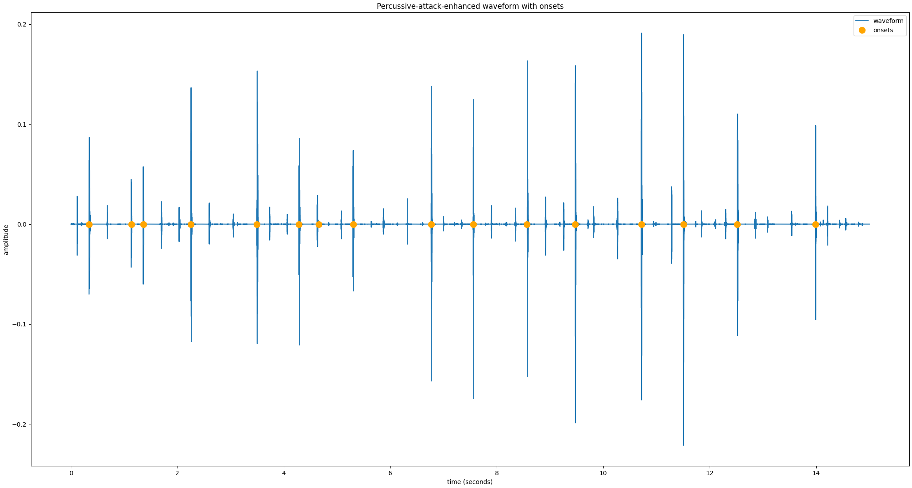
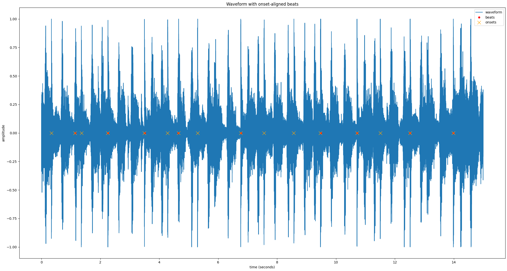

# headbang.py

* TOC
{:toc}

## Introduction

headbang.py is a collection of beat-tracking related projects, exploring beat tracking and the phenomenon of headbanging in metal music. It is presented as my final project for MUMT 621 Music Information Retrieval, and it consists of:

* headbang: a Python library implementing beat tracking for fully mixed percussive metal songs
    * `ConsensusBeatTracker` is  a beat-tracking ensemble algorithm that combines the outputs of 6 different beat trackers
    * `HeadbangBeatTracker` is a beat-tracking meta-algorithm that aligns the outputs of the consensus beat tracker with strong percussive onsets
* headbang-hud: a Python script which analyzes MP4 videos and uses 2D pose estimation to track head motion and headbang peaks to display alongside beat tracking results

Instructions for how to install the dependencies and run the various scripts and components are in [the source code's README](https://github.com/sevagh/headbang.py).

Post any questions, concerns, or contributions via GitHub issues.

# headbang: beat tracking algorithms for fully-mixed prog metal

The original motivation of `HeadbangBeatTracker` was to only predict beats that aligned with strong percussive onsets. The most common form of beat tracking output is overlaying clicks on the input audio track - in my opinion, it is very displeasing when the click is wrong. `HeadbangBeatTracker` is focused on eliminating false positives, and will output much fewer "strong beats" than the underlying beat trackers.

For example, during a segment of the song where there is a lull and the drums are silent, there may be a silent/implicit beat, but `HeadbangBeatTracker` will not emit any clicks. The code has been tested mostly on prog metal and djent - Vitalism, Kadinja, Periphery, Anup Sastry, Meshuggah, Animals as Leaders, etc. As there are no ground truth annotations for such music, all of the testing and verification was done manually by yours truly, with some helper scripts - the workflow will be described later on.

## Algorithm 1 - ConsensusBeatTracker

The first algorithm of the `headbang` library is a consensus/ensemble beat tracker, implemented in the `ConsensusBeatTracker` class. The following visuals describe how the algorithm works at a high level:

**Input** is provided as a single audio file containing the full-length metal song:


Note that the plots are generated with a small segment (15s) extracted from a full song to demonstrate the algorithm more clearly. For best beat results, it's better to pass in the full song. I've tested a range of 3-16-minute songs with accurate tracking throughout. A small, isolated segment of a song will generally lead to bad beat tracking results.

**Multiple beat tracking algorithms** are applied on the input directly (without preprocessing):


The list of beat trackers consist of:
1. [madmom](https://madmom.readthedocs.io/en/latest/modules/features/beats.html) RNNBeatProcessor -> DBNBeatTrackingProcessor
2. madmom RNNBeatProcessor -> BeatDetectionProcessor
3. [Essentia BeatTrackerMultiFeature](https://essentia.upf.edu/reference/std_BeatTrackerMultiFeature.html)
4. [Essentia BeatTrackerDegara](https://essentia.upf.edu/reference/std_BeatTrackerDegara.html)
5. [librosa beat_track](https://librosa.org/doc/latest/generated/librosa.beat.beat_track.html)
6. [BTrack](https://github.com/adamstark/BTrack)

The list can be controlled via the `algorithms="1,2,3,4,5,6"` parameter.

These are executed in parallel using Python's [multiprocessing](https://docs.python.org/3/library/multiprocessing.html) module. The code is designed to be executed by the pool [`starmap`](https://docs.python.org/3/library/multiprocessing.html#multiprocessing.pool.Pool.starmap) pool function:
```python
def apply_single_beattracker(x, algo):
    beats = None
    if algo == 1:
        beats = algo1(x, ...)
    elif algo == 2:
        beats = algo2(x, ...)
    ...

    return beats

def apply_consensus(x):
    all_algos = [1, 2, 3, 4, 5, 6, 7, 8]
    all_results = pool.starmap(
            apply_single_beattracker,
            zip(itertools.repeat(x), all_algos)
    )
```

This results in the following executions invoked in parallel on the input signal `x`:
```python
apply_single_beattracker(x, 1)
apply_single_beattracker(x, 2)
...
```

**Consensus** of these beats is taken with [essentia's TempoTapMaxAgreement](https://essentia.upf.edu/reference/std_TempoTapMaxAgreement.html):

Previously, I invented my own consensus algorithm using numpy, by counting beat locations from different algorithms that were within a threshold of each other and had sufficient agreement. I discovered through trial and error that TempoTapMaxAgreement did a much better job:


At this point, these are usable outputs of the standalone **ConsensusBeatTracker** class. The post-processing is optional (but it helps for trickier songs).

## Algorithm 2 - HeadbangBeatTracker

The HeadbangBeatTracker first gathers beats using the ConsensusBeatTracker, and then applies post-processing for percussive onset alignment. To disable the onset alignment and return the consensus results only, set the parameter `disable_onsets=True`.

**Percussion is separated** from the input signal with [median-filtering Harmonic-Percussive Source Separation](https://librosa.org/doc/0.8.0/generated/librosa.decompose.hpss.html):


**TODO** The parameters that control the HPSS step are `harmonic_frame=16384`, `percussive_frame=256`, `harmonic_margin=2.3`, `percussive_margin=2.3`. To be brief, an optimal percussion separation (using pure DSP, not fancy modern machine learning source separation) is achieved doing a first pass with a high frequency resolution, to isolate harmonic, pitched sounds (frame size of 16384), and a second pass with a high time resolution (frame size of 256). Further reading at Driedger,  Fitzgerald, Music-Separation-TF.

**Transients are enhanced** using my [multi-band transient enhancer](https://gitlab.com/sevagh/multiband-transient-shaper), which is an adaptation of the SPL differential envelope transient shaper[[1]](#1).

This enhances the percussive attacks and gates sustained/steady-state sounds, making a more sparse "drum hit waveform":


**Onset detection** is performed using a combination of 2 onset detection functions, hfc, and rms (from [Essentia](https://essentia.upf.edu/reference/streaming_OnsetDetection.html)), weighted most heavily on hfc for percussive event detection:



**Beats are aligned with percussive onsets**, to eliminate predicted beats that don't fall on a percussive attack.

Beats and onsets that lie within `onset_align_threshold_s=0.07` seconds of each are considered aligned:



The value of 0.07 was inspired by mir_eval, which uses a window of 0.07 seconds to consider two beats to be equivalent events (when evaluating beat tracking results of an algorithm vs. the ground truth annotations).

**Sections with no beats are supplemented with percussive onsets**

The final step verifies that there are any long gaps with no beats (`max_no_beats=1`). If there are gaps, percussive onsets are inserted. It's assumed that the beat trackers "got confused" and that it's better to fall back to strong percussive attacks to maintain a click continuity.

If the song truly contains no drum hits during that period, then there are no percussive onsets either, so `HeadbangBeatTracker` maintains the necessary silence.

There is a parameter `onset_near_threshold_s=0.35`, which controls how far onsets must be spaced apart to be substituted for beats. Sometimes, there is a quick succession of percussive onsets, but I don't want to hear clicks too close together.

The final waveform contains consensus beats supplemented with extra percussive onsets:


This is the final output of the **HeadbangBeatTracker**.

## Block diagram

## Perceptual evaluation

I did the main development and testing of `headbang` with my own ears by overlaying clicks and listening to full-length metal songs continually while tweaking different parameters.

The two useful scripts are `bin/beat_track.py`, which contains command-line arguments for every constructor parameter of `ConsensusBeatTracker` and `HeadbangBeatTracker`, and `bin/reference_beats.py`, which lets us apply each of the individual algorithms separately.

The full help text of `beat_track.py` displays the extent of configuration options:
```
sevagh:headbang.py $ ./bin/beat_track.py --help
[   INFO   ] MusicExtractorSVM: no classifier models were configured by default
usage: headbang.py [-h] [--algorithms ALGORITHMS] [--onset-align-threshold-s ONSET_ALIGN_THRESHOLD_S]
                   [--max-no-beats MAX_NO_BEATS] [--onset-near-threshold-s ONSET_NEAR_THRESHOLD_S]
                   [--onset-silence-threshold ONSET_SILENCE_THRESHOLD] [--n-pool N_POOL] [--show-plots] [--disable-onsets]
                   [--beats-out BEATS_OUT] [--harmonic-margin HARMONIC_MARGIN] [--harmonic-frame HARMONIC_FRAME]
                   [--percussive-margin PERCUSSIVE_MARGIN] [--percussive-frame PERCUSSIVE_FRAME]
                   [--fast-attack-ms FAST_ATTACK_MS] [--slow-attack-ms SLOW_ATTACK_MS] [--release-ms RELEASE_MS]
                   [--power-memory-ms POWER_MEMORY_MS] [--filter-order FILTER_ORDER]
                   wav_in wav_out
```

For example, when I was evaluating different values for the harmonic frame size for HPSS, the evaluation could look something like this:
```bash
for harm_frame in 256 1024 4096 16384; do
    ./bin/beat_track.py \
        --harmonic-frame=$harm_frame \
        input_metal_song.wav \
        output_metal_song_harm_window_$harm_window.wav
done
```

Using `reference_beats.py`, I was able to pare down the original list of 8 algorithms in the consensus down to 6. Madmom's BeatTrackingProcessor and CRFBeatDetectionProcessor were eliminated, both of which I found to produce poor results (on my custom testbench) on their own, indicating that they were not useful members of the consensus.

### Results

Here's a table of some interesting outputs of headbang's algorithms:
<table>
  <tbody>
    <tr>
      <th align="left">Song</th>
      <th align="left">madmom DBN</th>
      <th align="left">Headbang</th>
    </tr>
    <tr>
      <td><a href="https://www.youtube.com/watch?v=NpuV825cMuA">Tyler the Creator - Who Dat Boy</a></td>
      <td></td>
      <td></td>
    </tr>
    <tr>
      <td><a href="https://www.youtube.com/watch?v=ljwwIpPbrJM">Periphery - The Bad Thing</a></td>
      <td></td>
      <td></td>
    </tr>
    <tr>
      <td><a href="https://www.youtube.com/watch?v=VaE62m_a8oQ">Volumes - The Mixture</a></td>
      <td></td>
      <td></td>
    </tr>
    <tr>
      <td><a href="https://www.youtube.com/watch?v=Pru_5HW9Ofg">Vitalism - Luxata</a></td>
      <td></td>
      <td></td>
    </tr>
  </tbody>
</table>

## MIREX-inspired evaluation and results

I evaluated headbang's `ConsensusBeatTracker` against the MIREX SMC12 dataset[[2]](#2), using the [mir_eval](https://github.com/craffel/mir_eval) library[[3]](#3). [MIREX 2019](https://www.music-ir.org/mirex/wiki/2019:MIREX2019_Results) is the most recent year of the audio beat tracking challenge (2020 results are not ready yet).

The summary of MIREX 2019 results on the SMC dataset is:


To anchor my own evaluation to the above, I will include results for the consensus beat tracker alongside the madmom [DBNBeatTracker](https://github.com/CPJKU/madmom/blob/master/bin/DBNBeatTracker)[[4]](#4), or SB1 in the above table. Note that this beat tracker is among the 8 used in my consensus algorithm.

The 4 measures that will be evaluated (F-measure, Cemgil, Goto, and McKinney P-Score) are the same as those used in MIREX, and are borrowed from the [Beat Evaluation Toolbox](https://code.soundsoftware.ac.uk/projects/beat-evaluation/)[[5]](#5).

An additional 2 measures were added by splitting the F-measure into its constituent precision and recall (simply by copy-pasting the mir_eval f_measure function and returning the individual measures). This should help with a more fine-grained analysis of results. My hypothesis is that the precision of `ConsensusBeatTracker` could be higher at the expense of recall. In other words, it makes less beat predictions, due to the constraining nature of consensus, but the ones it does make should be very accurate.

The mir_beat_eval.py script (in the base directory of the repository) loads the SMC dataset (which you can [download here](http://smc.inesctec.pt/research/data-2/)). The SMC dataset contains wav files and ground-truth annotations. The script evaluates the results of the madmom DBNBeatTracker and every possible combination of `ConsensusBeatTracker` out of the 6 individual beat tracking algorithms:

```python
>>> algos = [1, 2, 3, 4, 5, 6]
>>> for x in range(len(algos)):
...     print([x for x in itertools.combinations(algos, x+1)])
...
[(1,), (2,), (3,), (4,), (5,), (6,)]
[(1, 2), (1, 3), (1, 4), (1, 5), (1, 6), (2, 3), (2, 4), (2, 5), (2, 6), (3, 4), (3, 5), (3, 6), (4, 5), (4, 6), (5, 6)]
[(1, 2, 3), (1, 2, 4), (1, 2, 5), (1, 2, 6), (1, 3, 4), (1, 3, 5), (1, 3, 6), (1, 4, 5), (1, 4, 6), (1, 5, 6), (2, 3, 4), (2, 3, 5), (2, 3, 6), (2, 4, 5), (2, 4, 6), (2, 5, 6), (3, 4, 5), (3, 4, 6), (3, 5, 6), (4, 5, 6)]
[(1, 2, 3, 4), (1, 2, 3, 5), (1, 2, 3, 6), (1, 2, 4, 5), (1, 2, 4, 6), (1, 2, 5, 6), (1, 3, 4, 5), (1, 3, 4, 6), (1, 3, 5, 6), (1, 4, 5, 6), (2, 3, 4, 5), (2, 3, 4, 6), (2, 3, 5, 6), (2, 4, 5, 6), (3, 4, 5, 6)]
[(1, 2, 3, 4, 5), (1, 2, 3, 4, 6), (1, 2, 3, 5, 6), (1, 2, 4, 5, 6), (1, 3, 4, 5, 6), (2, 3, 4, 5, 6)]
[(1, 2, 3, 4, 5, 6)]
```

The median score for each of the six measure was taken across the 218 tracks of SMC.

### Results

Output results:
```
| algorithm   |   F-measure |     Cemgil |      Goto |   McKinney P-score |   Precision |     Recall |
|-------------|-------------|------------|-----------|--------------------|-------------|------------|
| SB1         |  0.55288    | 0.436283   | 0.225806  |         0.649583   |   0.537928  | 0.602492   |
| consensus   |  0.46131    | 0.360548   | 0.0368664 |         0.527189   |   0.411873  | 0.576754   |
```

# headbang-hud: combining MIR and 2D pose estimation

The goal of headbang-hud to analyze videos that contain metal music (e.g. metal concerts or guitar covers) and at least one human subject (musician, audience, or otherwise) who is headbanging (moving their head and neck vertically and vigorously on the beat). The HUD will draw the following information over the original video:

* OpenPose tracked keypoints per frame, drawn on the people
* <span style="background-color: #000000"><span style="color: #FFFF00">**BOP**</span></span>: head motion peaks, or headbangs , and associated tempo (in bpm)
* <span style="background-color: #000000"><span style="color: #FF0000">**BEAT**</span></span>: beat outputs of `ConsensusBeatTracker`, and associated tempo (in bpm)
* <span style="background-color: #000000"><span style="color: #00FF00">**GROOVE**</span></span>: when a BOP and a BEAT hit at the same time, the music _grooves_
* <span style="background-color: #000000"><span style="color: #00A5FF">**BEAT+**</span></span>: beat outputs of `HeadbangBeatTracker`

`headbang-hud/headbang-hud.py` is a single script in the overall [headbang.py](https://github.com/sevagh/headbang.py) repository.


Here's a demo from a live [Cannibal Corpse concert](https://www.youtube.com/watch?v=Y82rls0yoAM):


The hypothesis is that certain parts of songs are so groovy that they impel either the musician or the audience (or both) to headbang on the beat. If these moments can be identified and displayed alongside MIR beat tracking, they could give us insight into the relation of headbanging to beats.

## Groove

headbang-hud started off as groove-dashboard, inspired by this paper[[1]](#1), which associates audio signal features or MIR features to human judgements of groove. The paper defines groove as follows:

>The experience of groove is associated with the urge to move to a musical rhythm

From this definition I was inspired to look towards the field of computer vision and pose estimation to track the motion jointly with musical measures of groove.

Strong beats are also associated with groove[[11]](#11), [[12]](#12). The two beat tracking algorithms presented in the first part of the website will be used to compute beats and strong beats.

## 2D pose estimation with OpenPose

The pose estimation component was inspired by the preprinted paper [[14]](#14), at a high level. That paper analyzes beat synchrony of salsa dancers' foot motion. The ideas borrowed were to:
* Use OpenPose to get 2D coordinates for detected keypoints of the body parts of interest
* Normalize the coordinates
* Record the normalized coordinates per frame of the video
* Use peak picking to estimate peaks in motion

[OpenPose](https://github.com/CMU-Perceptual-Computing-Lab/openpose) is a "real-time multi-person keypoint detection library for body, face, hands, and foot estimation"[[13]](#13), written in C++, along with a Python wrapper. When you pass a frame of a video through OpenPose, it returns the detected human pose keypoints and a copy of the frame with the keypoints drawn over it:

[](https://www.youtube.com/watch?v=DPC9erC5WqU)

In this project, OpenPose is configured to use the BODY_25 model, which is their fastest performing pose detector.

The calculation of head motion and peaks uses the returned (x, y) coordinations, which contains the position of each keypoint per frame. The keypoints `[0, 1, 15, 16, 17, 18]` correspond to the nose, neck, right eye, left eye, right ear, and left ear respectively. The median y coordinate of these keypoints is taken (the x coordinate is discarded, since side-to-side head movement is less typical).

Finally, the y coordinate is normalized by the size of the video to produce values in the range of [0, 1.0]. In this way, for every frame of the video, we have the median normalized y coordinate of the head and neck region, which correspond to headbanging motion.

From the y coordinates accumulated from all of the video frames, [scipy find_peaks_cwt](https://docs.scipy.org/doc/scipy/reference/generated/scipy.signal.find_peaks_cwt.html) is used with a width of 10 (e.g. find 1 peak every 10 frames), which gives us robust results for tracking the extreme ranges of motion while avoiding spurious peaks.

This plot shows the resulting normalized median y coordinate evolution over time (i.e. motion) with detected peaks (magenta lines mark the peaks):


These peaks in y coordinate motion of the head and torso are called "bops", or the pose/motion analog of a beat.

### Using different keypoints

The command line flag `--custom-keypoints` takes a comma-separated string representing different BODY_25 pose keypoints (overriding the default face and neck). All possible values can be seen here:
* https://github.com/CMU-Perceptual-Computing-Lab/openpose/blob/18de3a0010dd65484b3eb357b5c3679c9a2fdf43/doc/02_output.md#pose-output-format-body_25
* https://github.com/CMU-Perceptual-Computing-Lab/openpose/blob/18de3a0010dd65484b3eb357b5c3679c9a2fdf43/doc/02_output.md#keypoint-ordering-in-cpython

For example, in the drummer demo, I used `./headbang-hud/headbang-hud.py --custom-keypoints "2,3,4,5,6,7"` - those keypoints correspond to the left and right arms (shoulder, elbow, wrist).

## BPM estimation

Tempo estimation given beat locations can be defined as the inter-beat interval. One way of computing this is by getting the slope of scipy's linear regression across the beat times. I got the idea from [this GitHub issue on madmom](https://github.com/CPJKU/madmom/issues/416):

```python
def bpm_from_beats(beats):
    if beats.size == 0:
        return 0
    m_res = scipy.stats.linregress(numpy.arange(len(beats)), beats)

    first_beat = m_res.intercept
    beat_step = m_res.slope

    return 60 / beat_step
```

In the code, events (beats or bops) from the last 3 seconds of history are considered in the bpm computation, so it may take some time for the bpm to "converge" to correctness after a stable sequence of events.

Also, the subjects in the video may move however they want - finding a stable bpm from motion depends on processing frames displaying very clear and stable periodic motion, but sequences like this are rare in natural videos.

## Demos

[Bryan Baker: second demo from debut album from Vesser](https://www.youtube.com/watch?v=Te-JCT96cgQ):


[Arial Mann - sickened](https://www.youtube.com/watch?v=Ls9QJEE0Drw):


Note the off-beat head bops at first, which transition to being on-beat.

[Keith Ape - It G Ma](https://www.youtube.com/watch?v=Ls9QJEE0Drw):


Although all the talk is about metal so far, it works well on the above rap song.

Here's a clip from drummer [Anup Sastry - Titan](https://www.youtube.com/watch?v=Y82rls0yoAM), where the motion is tracked on the left and right arms (instead of the head and neck):


## Code design diagram

inkscape diagram
2 passes to avoid oom. moviepy write to tmp file

# Discussion, conclusion, etc.

mention this also, another OpenPose music paper - replace beat tracking with pose detection - waw: https://program.ismir2020.net/poster_3-10.html

# References

<a id="1">[1]</a>
Gier, H & Paul White, "SPL Transient Designer, DUAL-CHANNEL, Model 9946, Manual"
URL: https://spl.audio/wp-content/uploads/transient_designer_2_9946_manual.pdf

<a id="2">[2]</a>
Holzapfel, A.; Davies, M.E.P.; Zapata, J.R.; Oliveira, J.L.; Gouyon, F.; , "Selective Sampling for Beat Tracking Evaluation," Audio, Speech, and Language Processing, IEEE Transactions on , vol.20, no.9, pp.2539-2548, Nov. 2012
doi: 10.1109/TASL.2012.2205244
URL: http://ieeexplore.ieee.org/stamp/stamp.jsp?tp=&arnumber=6220849&isnumber=6268383

<a id="3">[3]</a>
Böck, Sebastian & Krebs, Florian & Widmer, Gerhard. (2014). A MULTI-MODEL APPROACH TO BEAT TRACKING CONSIDERING HETEROGENEOUS MUSIC STYLES.

<a id="4">[4]</a>
Colin Raffel, Brian McFee, Eric J. Humphrey, Justin Salamon, Oriol Nieto, Dawen Liang, and Daniel P. W. Ellis, "mir_eval: A Transparent Implementation of Common MIR Metrics", Proceedings of the 15th International Conference on Music Information Retrieval, 2014.

<a id="5">[5]</a>
Matthew E. P. Davies,  Norberto Degara, and Mark D. Plumbley. "Evaluation Methods for Musical Audio Beat Tracking Algorithms", Queen Mary University of London Technical Report C4DM-TR-09-06, London, United Kingdom, 8 October 2009.

<a id="1">[1]</a> 
Stupacher, Jan & Hove, Michael & Janata, Petr. (2016). Audio Features Underlying Perceived Groove and Sensorimotor Synchronization in Music. Music Perception. 33. 571-589. 10.1525/mp.2016.33.5.571. 

<a id="2">[2]</a>
Burger, Birgitta & Ahokas, J. Riikka & Keipi, Aaro & Toiviainen, Petri. (2013). Relationships between spectral flux, perceived rhythmic strength, and the propensity to move. 

<a id="3">[3]</a>
Dixon, Simon. (2006). Simple spectrum-based onset detection. 

<a id="4">[4]</a>
Böck, Sebastian, and Gerhard Widmer. “Maximum filter vibrato suppression for onset detection.” 16th International Conference on Digital Audio Effects, Maynooth, Ireland. 2013.

<a id="6">[6]</a>
Lartillot, Olivier & Eerola, Tuomas & Toiviainen, Petri & Fornari, Jose. (2008). Multi-Feature Modeling of Pulse Clarity: Design, Validation and Optimization. 521-526. 

<a id="7">[7]</a>
Madison, Guy & Gouyon, Fabien & Ullén, Fredrik & Hörnström, Kalle. (2011). Modeling the Tendency for Music to Induce Movement in Humans: First Correlations With Low-Level Audio Descriptors Across Music Genres. Journal of experimental psychology. Human perception and performance. 37. 1578-94. 10.1037/a0024323. 

<a id="8">[8]</a>
C. Song, M. Pearce, and C. Harte, SynPy: a Python Toolkit for Syncopation Modelling. Maynooth, Ireland, 2015.

<a id="9">[9]</a>
Madison, Guy & Sioros, George. (2014). What musicians do to induce the sensation of groove in simple and complex melodies, and how listeners perceive it. Frontiers in Psychology. 5. 10.3389/fpsyg.2014.00894. 

<a id="10">[10]</a>
Sioros, George & Miron, Marius & Davies, Matthew & Gouyon, Fabien & Madison, Guy. (2014). Syncopation creates the sensation of groove in synthesized music examples. Frontiers in psychology. 5. 1036. 10.3389/fpsyg.2014.01036. 

<a id="11">[11]</a>
Madison G, Gouyon F, Ullen F. Musical groove is correlated with properties of the audio signal as revealed by computational modelling, depending on musical style. In: Proceedings of the SMC 2009—6th Sound and Music Computing Conference. 2009. p. 239–40.

<a id="12">[12]</a>
Madison G, Gouyon F, Ullén F, Hörnström K. Modeling the tendency for music to induce movement in humans: First correlations with low-level audio descriptors across music genres. J Exp Psychol Hum Percept Perform. 2011; 37:1578–1594. pmid:21728462

<a id="13">[13]</a>
Z. Cao, G. Hidalgo, T. Simon, S. -E. Wei and Y. Sheikh, "OpenPose: Realtime Multi-Person 2D Pose Estimation Using Part Affinity Fields," in IEEE Transactions on Pattern Analysis and Machine Intelligence, vol. 43, no. 1, pp. 172-186, 1 Jan. 2021, doi: 10.1109/TPAMI.2019.2929257.

<a id="14">[14]</a>
Quantifying music-dance synchrony with the application of a deep learning-based 2D pose estimator
Filip Potempski, Andrea Sabo, Kara K Patterson
bioRxiv 2020.10.09.333617; doi: https://doi.org/10.1101/2020.10.09.333617 
